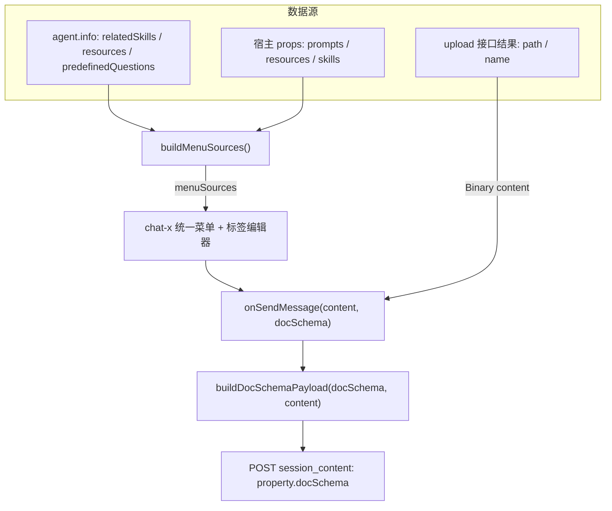

# chat-x 0.0.52 输入区资源引用 —— 会议结论与协议

> 面向对象：ai-blueking 维护方、后端 Agent 团队、chat-x 组件团队
> 关联 commit：chat-x `e0aea36786fc4fd9d620bf54b97395407f4cfbdc`（`@blueking/chat-x@0.0.52-beta.1`）
> 状态：**已按会议结论落地**。早期「原始对象回传 + sourceMap / extra.resources」方案已废弃。

---

## 0. 最终结论

1. `agent/info` 接口不变。ai-blueking 把 `relatedSkills` / `resources` / `predefinedQuestions`（以及宿主 `prompts` / `resources` / `skills`）映射为 chat-x `menuSources`。
2. 发送时把 chat-x 给出的 `docSchema` **原样**放到 `property.docSchema`（与 `extra` **同级**，不放进 `extra`）。
3. **只发 docSchema**，不再写 `property.extra.resources`。`extra` 只保留 `cite` / `command` / `context`。
4. 上传文件/图片：`content` 里 Binary 逻辑不变，**额外**在 `property.docSchema` 补一条 artifact 标签（`file` → `artifact`、`name` → `label`、`path` → `value`）。
5. 对外仍保留 `prompts` / `resources` / `skills` 三个 props（宿主零改动）；`AIBlueking` 不补 `skills`。`prompts` 仍是 `string[]`，name/content 都用全文。
6. chat-x 读取键位由 chat-x 维护者改：优先 `property.docSchema`，回退 `extra.docSchema`。渲染时建议跳过 `value` 命中 Binary `id` 的 artifact 标签，避免与文件卡片双重展示。

---

## 1. 必须交付给后端的协议表（`value` 语义）

docSchema 的标签节点**只携带 5 个字段**，原始资源对象不会进入 docSchema：

```ts
{ type: 'tag', data: { type, label, value, icon, description } }
```

后端能拿到的标识就是 `value` 这一个字符串：

| `data.type`     | `value` 放什么                                               | `label`      | 来源                       |
| --------------- | ------------------------------------------------------------ | ------------ | -------------------------- |
| `skill`         | `skill_code`                                                 | `skill_name` | `agent.info.relatedSkills` |
| `mcp`           | `code`                                                       | `name`       | `agent.info.resources`     |
| `tool`          | `code`                                                       | `name`       | `agent.info.resources`     |
| `knowledgebase` | `String(id)`（数值 id 的字符串），`id` 为 null 时回退 `code` | `name`       | `agent.info.resources`     |
| `doc`           | 同 `knowledgebase`（旧遗留类型，两者都要兼容）               | `name`       | `agent.info.resources`     |
| `artifact`      | PV 相对路径（会话产物的 `outputId`；上传文件的 `path`）      | 文件名       | 消息产物 / 上传结果        |

知识库用数值 id 的字符串，是因为后端现有收窄逻辑拿 `id` 与 `config.knowledgebase_ids` 比较。适配时 `int()` 即可。`prompt` 不在表内：选中 prompt 走整体替换文本，不产生标签。

---

## 2. 发送载荷示例

```json
{
  "role": "user",
  "content": [
    { "type": "binary", "id": "files/report.yaml", "filename": "report (7).yaml", "mime_type": "application/x-yaml", "size": 1909 },
    { "type": "text", "text": "分析 @report (7).yaml 和 @运维知识库" }
  ],
  "property": {
    "docSchema": [
      [
        { "type": "text", "text": "分析 " },
        { "type": "tag", "data": { "type": "artifact", "label": "report (7).yaml", "value": "files/report.yaml", "icon": "", "description": "" } },
        { "type": "text", "text": " 和 " },
        { "type": "tag", "data": { "type": "knowledgebase", "label": "运维知识库", "value": "58", "icon": "", "description": "" } }
      ]
    ],
    "extra": { "command": "summary" }
  }
}
```

注意 `extra` 里**没有** `resources`。无任何标签时不要写 `docSchema`。

---

## 3. 数据流



`buildMenuSources` 丢弃 `shortcut` / `file` / `artifact` / 未知 type / 空 id。
`buildDocSchemaPayload` 原样透传编辑器文档（上传文件的 artifact 行由 chat-x 在发送前注入）。

---

## 4. 前端落地（已完成）

- `IHostResourceItem` / `IHostSkillItem`：宿主 props 兼容类型，不再依赖已删除的 `IAiSlashMenuItem` / `ISkillListItem`
- `useChatbotState.effectiveMenuSources`：props 优先，否则 `agent.info`
- `AIBlueking` 只透传 `prompts` / `resources`，不自己映射
- 发送 / 编辑写 `property.docSchema`；移除 `selectedResources` 与 `extra.resources`
- chat-helper `IMessageProperty.docSchema?: unknown`
- peerDep `@blueking/chat-x >=0.0.52-beta.1`

## 5. chat-x 承接上传文件的 artifact 标签注入（已完成）

读取键位已由 chat-x `839ffed` 改为 `property.docSchema`。

**上传文件的 artifact 标签由 chat-x 在 `onSendMessage` 前注入进 `docSchema`**，`ai-blueking` 只做透传。

放在 chat-x 的理由：

- 只有 chat-x 同时持有上传响应原文（`path` / `name`）与当前附件列表，注入点唯一
- 业务层拿不到协议字段：改造前 `ChatInputUploadResult` 没有 `name`、`applyUploadResult` 也没存；`chat-helper` 的消息 transform 双向都丢掉了 `outputId`，历史消息重载后无法再推导
- 编辑回填时文档里已含上次注入的标签，业务层再追加会重复；chat-x 自己注入可按 `value` 去重
- 双重展示（文件卡片 + Mention 标签）也在 chat-x 侧：渲染时跳过 `value` 命中附件 `outputId` 的 artifact 标签，两半在同一个包里改才自洽

已落地的改动：

1. `chat-input.vue` `buildSendDocSchema()`：emit 前把有 `outputId` 的附件按 `{ type: 'artifact', label: 文件名, value: path }` 追加成一行，按 `value` 与文档内已有标签去重（编辑回填不会重复追加）
2. `user-message.vue` 渲染与编辑回填前调用 `omitArtifactTags`，剥掉 `value` 命中当前附件的 artifact 标签，避免与 `FileContent` 卡片重复
3. `chat-helper` 的消息 transform 双向透传 `outputId` ↔ `output_id`，历史消息重载后仍能按 `outputId` 匹配。后端 `SessionContent.content` 是 `list[dict]` 且 `extra="allow"`，content 内的键原样存取，无需后端改动

注入与剥离共用 `src/utils/artifact-tags.ts` 一套 `value` 口径，避免两边漂移。

**附件展示名不走上传响应**：`uploadPvFiles` 原样提交 `File`，服务端登记名与本地 `file.name` 一致，所以展示名一律取本地名（编辑态取持久化的 `filename`）。这样选中文件即可见、不必等接口返回，上传完成后也不会发生名字跳变；`artifact` 标签 `label` 与 `@` 菜单条目名同源于此。
