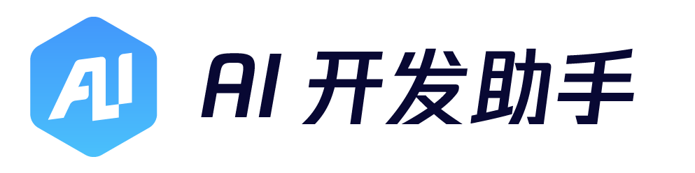

[](https://github.com/TencentBlueKing/bk-aidev-agent/blob/master/LICENSE.txt)
[](https://github.com/TencentBlueKing/bk-aidev-agent/releases)
[](https://codecov.io/gh/TencentBlueKing/bk-aidev-agent)
[](https://github.com/TencentBlueKing/bk-aidev-agent/pulls)


[(English Documents Available)](./readme_en.md)

## 🚀 产品概述

蓝鲸 AIDev 平台致力于为研发生命周期的关键阶段提供卓越的智能研发工具支持，为业务通用AI场景提供工具支持，为满足不同业务场景需求提供自定义开发扩展能力

## ✨ 核心特性

### 智能体开发框架
| 功能      | 描述                                                               |
|---------|------------------------------------------------------------------|
| 🤖 [通用智能体](./src/agent) | 基于 LangChain 的智能体开发框架，提供工具调用、记忆管理、流式输出等核心能力，<br />支持快速构建自定义智能体应用 |
| 🔌 [蓝鲸插件](./src/plugins/aidev_bkplugin) | 智能体插件化封装，可快速接入蓝鲸生态系统（如标准运维、bkflow）                               |
| 🐳 [AI 小鲸](./src/plugins/aidev_ai_blueking) | 智能体官网插件，提供多轮对话、会话管理、内容分享等完整的 Web 交互体验                            |
| 💬 [企业微信](./src/plugins/aidev_wxbot) | 企业微信机器人插件，支持消息回调处理、自动化响应、RabbitMQ 消息队列集成                         |


### AI 小鲸智能组件
| 功能 | 描述 |
|------|------|
| 💬 智能对话 | 支持流式输出的自然语言交互 |
| 📝 富文本渲染 | Markdown 消息解析与展示 |
| 🔗 内容引用 | 文档片段引用与上下文关联 |
| ⚡ 快捷操作 | 预设指令与快捷功能支持 |

### 小鲸文档系统
| 功能 | 描述 |
|------|------|
| 📚 使用指南 | 从入门到精通的详细教程 |
| 🛠️ API 参考 | 完整的接口与类型定义 |
| 💡 示例中心 | 典型场景的代码示例 |
| 🔍 交互演示 | 可操作的实时演示环境 |
| 📜 版本管理 | 清晰的变更历史记录 |


## 🛠️ 快速开始

### 系统要求
- Python 3.11+
- uv 0.7.14+
- Node.js 20+

### Agent 开发
1. 确认 uv 版本
    ```bash
    $ uv --version
    uv 0.7.14 (e7f596711 2025-06-23)
    ```

2. 初始化项目环境（虚拟环境位于项目根目录 `.venv` 下），此步骤将始化本地`pre-commit`组件
   ```shell
   $ make
   ```

3. 更多开发说明请参考：
   - [通用智能体 SDK 开发指南](./src/agent/readme.md)
   - [蓝鲸插件开发指南](./src/plugins/aidev_bkplugin/readme.md)
   - [企业微信机器人开发指南](./src/plugins/aidev_wxbot/readme.md)

### 模板项目本地开发（快捷方式）
可参考 `template/{{cookiecutter.project_name}}/Makefile` 使用一键启动命令：
```bash
cd template/{{cookiecutter.project_name}}
make dev
```

> `make dev` 会自动执行 `migrate`、`createcachetable` 并启动本地服务（`0.0.0.0:5000`）。
> `.env` 请优先到 bkaidev 平台进入对应智能体，通过「下载源码」获取完整工程；源码包中已包含该智能体对应的 `.env` 文件。
> 下载后请将源码包中的 `.env` 放到本地模板项目根目录（`template/{{cookiecutter.project_name}}/.env`）再执行 `make dev`。
> 首次运行前请按模板说明完成本地域名 hosts 映射。

### 前端开发
#### 组件开发
```bash
cd src/frontend
pnpm install
pnpm dev:component  # 开发模式（AI小鲸组件）
pnpm build:component  # 生产构建（AI小鲸组件）
```

#### Vue2 组件测试
```bash
cd src/frontend
pnpm install
cd vue2-playground
pnpm run serve  # 启动 Vue2 环境测试
```

#### 文档开发
```bash
cd src/frontend
pnpm install
pnpm dev:docs  # 开发模式 (http://localhost:5173)
pnpm build:docs  # 生产构建
```

### 开发建议
1. 提交前请执行代码检查：
```bash
cd src/frontend/ai-blueking
pnpm prettier
```
2. 推荐开发工具：
- VS Code + Volar 扩展
- ESLint + Prettier
- Chrome 开发者工具

### 版本更新
发布前需统一更新仓库内各组件版本，可使用 Makefile 的 `release_versions` 指令：

**方式一：所有组件使用同一版本**
```bash
make release_versions VERSION=2.0.0b1
```
> 该方式会同时更新 `template/{{cookiecutter.project_name}}/VERSION` 文件，但**不会**更新 `aidev-ai-blueking`（其版本节奏与其他组件解耦）。如需同时发布 `aidev-ai-blueking`，请走方式二或使用 `make release_ai_blueking VERSION=...`。

**方式二：按组件分别指定版本**
```bash
make release_versions aidev_agent_version=2.0.0b1 aidev_bkplugin_version=2.0.0b2 aidev_wxbot_version=2.0.0b3 aidev_template_version=2.0.0rc4
```
也支持只指定部分组件，例如：
```bash
make release_versions aidev_ai_blueking_version=2.0.0rc1
```
未指定的组件会保持当前版本不变。

## 📂 项目结构
```
bk-aidev-agent/
├── src/
│   ├── agent/            # Agent SDK 核心
│   ├── frontend/         # 前端项目
│   │   ├── ai-blueking/  # AI 小鲸页面组件
│   │   │   ├── src/      # 组件源代码
│   │   │   ├── playground/ # 本地开发环境
│   │   │   └── scripts/  # 构建脚本
│   │   ├── publish-template/ # 发布模板工程
│   │   │   └── src/      # 模板应用源码
│   │   ├── vue2-playground/ # Vue2 环境测试工程
│   │   │   ├── src/      # Vue2 测试应用源码
│   │   │   └── public/   # 静态资源
│   │   └── web/          # 文档站点
│   │       ├── docs/     # 文档内容（api、guide、demos）
│   │       └── server.cjs # 文档服务器
│   └── plugins/          # 插件集合
│       ├── aidev_ai_blueking/ # AI小鲸页面插件：提供小鲸静态页入口和路由配置
│       ├── aidev_bkplugin/    # 蓝鲸智能体插件：智能体开发管理后台服务，包含前端页面、Agent服务、权限管理等
│       └── aidev_wxbot/       # 企业微信机器人插件：提供企微消息回调处理、自动化消息处理、RabbitMQ集成等
├── template/             # 二开智能体模板
│   └── {{cookiecutter.project_name}}/
│       ├── bk_plugin/    # 插件核心代码
│       │   ├── apis/     # API 接口
│       │   ├── extend/   # 扩展模块（agent、config_manager）
│       │   ├── openapi/  # 用于生成蓝鲸插件的应用态接口
│       │   ├── patch/    # 补丁模块
│       │   └── versions/ # 【重要】智能体配置
│       └── bin/          # 管理脚本
├── docs/                 # 项目设计文档
├── assets/               # 项目资源文件
├── dist/                 # 构建产物
└── Makefile              # 构建命令
```

## 📚 相关资源
### Agent 开发
- [Agent 常见问题](docs/agent/FAQ.md)
- [Agent 扩展开发指南](docs/agent/EXTENSION_AGENT.md)

### AI 小鲸
- [小鲸组件 API 文档](src/frontend/web/docs/api/props.md)
- [小鲸组件变更日志](src/frontend/ai-blueking/CHANGELOG.md)
- [小鲸组件常见问题](src/frontend/web/docs/faq.md)

## 💬 社区支持
- [蓝鲸论坛](https://bk.tencent.com/s-mart/community)
- [蓝鲸 DevOps 在线视频教程](https://bk.tencent.com/s-mart/video/)
- [蓝鲸社区版交流群](https://jq.qq.com/?_wv=1027&k=5zk8F7G)

## 🌐 蓝鲸开源生态
| 项目 | 描述 |
|------|------|
| [BK-CMDB](https://github.com/Tencent/bk-cmdb) | 企业级配置管理平台 |
| [BK-CI](https://github.com/Tencent/bk-ci) | 持续集成与交付系统 |
| [BK-BCS](https://github.com/Tencent/bk-bcs) | 容器管理服务平台 |
| [BK-PaaS](https://github.com/Tencent/bk-paas) | SaaS 应用开发平台 |
| [BK-SOPS](https://github.com/Tencent/bk-sops) | 标准运维调度系统 |
| [BK-JOB](https://github.com/Tencent/bk-job) | 作业脚本管理系统 |

## 🤝 参与贡献
我们欢迎各种形式的贡献！如果你有好的意见或建议，欢迎给我们提 Issues 或 Pull Requests，为蓝鲸开源社区贡献力量。

1. Fork 项目仓库
2. 创建特性分支 (`git checkout -b feat/your-feature`)
3. 提交更改 (`git commit -m 'feat: add some feature'`)
4. 推送到分支 (`git push origin feat/your-feature`)
5. 创建 Pull Request

[腾讯开源激励计划](https://opensource.tencent.com/contribution) 鼓励开发者的参与和贡献，期待你的加入。

## 📜 开源协议
本项目采用 [MIT 协议](./LICENSE.txt) 开源
