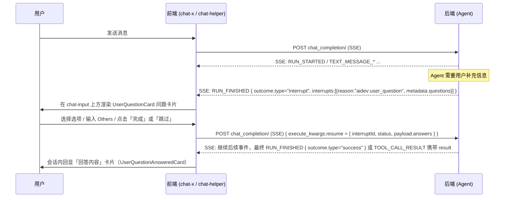

# Ask User Question 协议文档（前后端对接）

> 适用范围：`@blueking/chat-x` + `@blueking/chat-helper` + `@blueking/ai-blueking` 的「用户回答问题」（Ask User Question）人机协同（human-in-the-loop）中断能力。
>
> 协议基座：[AG-UI Interrupts](https://docs.ag-ui.com/drafts/interrupts)。本文以前端实际消费的字段为准。
>
> 中断标识：`reason = "aidev:user_question"`。

---

## 1. 总览与交互链路

Ask User Question 是一种「中断（Interrupt）」：Agent 执行过程中需要用户补充信息时，挂起本次运行，向前端下发一组问题；用户作答后，前端把答案作为 `resume` 回传，Agent 继续执行。



关键约定：

1. **下发**：通过 SSE `RUN_FINISHED` 事件，`outcome.type = "interrupt"`，问题数据位于 `interrupts[].metadata.questions`。
2. **回传**：通过 `POST chat_completion/`，在 `execute_kwargs.resume` 中携带 `{ interruptId, status, payload.answers }`。回传不调用独立的 `user_operation/` 接口（该接口仅用于审批取消 / 流程节点重试跳过）。
3. **回显**：后端二次返回 `RUN_FINISHED { outcome.type:"success" }`，或在 `TOOL_CALL_RESULT.content` 中返回 resume 结构（JSON 字符串），前端据此把同一条中断消息切换为「已回答」态。

---

## 2. 字段协议

### 2.1 中断下发结构（后端 → 前端）

承载于 SSE `RUN_FINISHED` 事件。事件整体结构：

```jsonc
{
  "type": "RUN_FINISHED",
  "runId": 123456,
  "threadId": "thread_xxx",
  "outcome": {
    "type": "interrupt",
    "interrupts": [
      {
        "id": "interrupt_user_question_001",   // 中断唯一 ID，回传 resume 时原样带回
        "reason": "aidev:user_question",         // 固定值，标识 Ask User Question
        "toolCallId": "tool_call_xxx",           // 触发该中断的工具调用 ID
        "message": "选择冒泡排序方案",            // 可选，卡片兜底标题
        "expiresAt": "2026-06-30T12:00:00Z",     // 可选，过期时间（ISO8601）
        "metadata": {
          "questions": [ /* UserQuestionItem[]，见下 */ ]
        }
      }
    ]
  }
}
```

#### Interrupt 字段表

| 字段 | 类型 | 必填 | 说明 |
| --- | --- | --- | --- |
| `id` | string | 是 | 中断唯一标识。前端回传 `resume.interruptId` 时原样带回。 |
| `reason` | string | 是 | 固定为 `"aidev:user_question"`。 |
| `toolCallId` | string | 是 | 触发本次中断的工具调用 ID。 |
| `message` | string | 否 | 中断说明文案；当 `questions[0].header` 为空时用作卡片标题兜底。 |
| `expiresAt` | string | 否 | 过期时间（ISO8601）。 |
| `metadata.questions` | `UserQuestionItem[]` | 是 | 待回答问题列表，至少 1 条。 |

#### UserQuestionItem（单个问题）

| 字段 | 类型 | 必填 | 说明 |
| --- | --- | --- | --- |
| `question` | string | 是 | 问题正文（题干）。回传答案时以此字段作为问题标识。 |
| `header` | string | 是 | 问题卡片标题。多题时前端取首题 `header` 作为卡片标题。 |
| `multiSelect` | boolean | 否 | 是否多选。`true`=多选，`false`=单选，**不传**=非选择题语义（前端不渲染单选/多选标签）。 |
| `options` | `UserQuestionOptionItem[]` | 否 | 选项列表。不传则该题仅有「Others 自定义输入」。 |

#### UserQuestionOptionItem（单个选项）

| 字段 | 类型 | 必填 | 说明 |
| --- | --- | --- | --- |
| `label` | string | 是 | 选项标识/简短标签（如 `"A"`、`"Java"`）。 |
| `description` | string | 是 | 选项展示文案。前端回显优先展示 `description`，为空时回退到 `label`。 |

> **重要约定（others）**：`label === "others"` 是保留值，代表「用户自定义输入项」。
> - 后端**无需**在 `options` 中下发 `others`；前端会自动在每题末尾追加一个 Others 输入项。
> - 若后端下发了 `label === "others"` 的选项，前端会将其过滤后再自动追加，避免重复。

#### 下发完整示例

```json
{
  "type": "RUN_FINISHED",
  "runId": 123456,
  "threadId": "thread_abc",
  "outcome": {
    "type": "interrupt",
    "interrupts": [
      {
        "id": "interrupt_user_question_001",
        "reason": "aidev:user_question",
        "toolCallId": "tool_call_user_question",
        "message": "选择冒泡排序方案",
        "metadata": {
          "questions": [
            {
              "header": "选择冒泡排序方案",
              "question": "请选择你想要的冒泡排序算法方案",
              "multiSelect": false,
              "options": [
                { "label": "A", "description": "方案1：基础冒泡排序" },
                { "label": "B", "description": "方案2：优化版冒泡排序" },
                { "label": "C", "description": "方案3：双向冒泡排序" }
              ]
            },
            {
              "header": "选择冒泡排序方案",
              "question": "请选择语言（可多选）",
              "multiSelect": true,
              "options": [
                { "label": "Java", "description": "Java" },
                { "label": "Python", "description": "Python" },
                { "label": "Go", "description": "Go" }
              ]
            }
          ]
        }
      }
    ]
  }
}
```

### 2.2 回答回传结构（前端 → 后端）

承载于 `POST chat_completion/` 请求体的 `execute_kwargs.resume` 字段。

#### Resume 字段表

| 字段 | 类型 | 必填 | 说明 |
| --- | --- | --- | --- |
| `interruptId` | string | 是 | 对应下发中断的 `id`。 |
| `status` | string | 是 | `"resolved"`=已回答；`"cancelled"`=已跳过/取消。 |
| `payload.answers` | `UserQuestionAnswerItem[]` | 是 | 各题答案，与 `questions` 一一对应（跳过时为空数组项）。 |

#### UserQuestionAnswerItem（单题答案）

| 字段 | 类型 | 必填 | 说明 |
| --- | --- | --- | --- |
| `question` | string | 是 | 与下发题目的 `question` 完全一致，作为问题标识。 |
| `answer` | `UserQuestionOptionItem[]` | 是 | 用户已选项数组。单选长度为 1，多选可多项，未作答为 `[]`。 |
| `multiSelect` | boolean | 否 | 回显用，原样带回该题的单选/多选标记。 |

`answer` 数组元素仍为 `{ label, description }`：

- 命中预设选项：`label`/`description` 取自下发选项。
- Others 自定义输入：`label = "others"`，`description = 用户输入的文本`。

#### 回传完整示例（结构化作答，已回答）

```json
{
  "session_code": "session_xxx",
  "execute_kwargs": {
    "stream": true,
    "persist_input": false,
    "resume": {
      "interruptId": "interrupt_user_question_001",
      "status": "resolved",
      "payload": {
        "answers": [
          {
            "question": "请选择你想要的冒泡排序算法方案",
            "multiSelect": false,
            "answer": [
              { "label": "B", "description": "方案2：优化版冒泡排序" }
            ]
          },
          {
            "question": "请选择语言（可多选）",
            "multiSelect": true,
            "answer": [
              { "label": "Java", "description": "Java" },
              { "label": "Python", "description": "Python" }
            ]
          },
          {
            "question": "请选择实现方式",
            "multiSelect": false,
            "answer": [
              { "label": "others", "description": "希望提供 TypeScript 泛型版本，并附带单元测试" }
            ]
          }
        ]
      }
    }
  }
}
```

### 2.3 答案回显结构（后端 → 前端）

回显复用 2.2 的 Resume 结构，挂在中断消息的 `result` 字段上，并通过以下两种事件之一触发：

- `RUN_FINISHED { outcome.type: "success" }`：前端把当前中断消息 `content` 替换为该事件，并将 `outcome.type` 视作 `success`。
- `TOOL_CALL_RESULT { content: "<resume JSON 字符串>" }`：前端 `JSON.parse(content)` 写入 `message.content.result`，并把 `outcome.type` 置为 `success`。

回显时前端按 `result.payload.answers` 逐题渲染「回答内容」卡片，`status = "cancelled"` 显示「已取消」，否则显示「已回复」。

---

## 3. API 交互协议

### 3.1 发起会话 / 回传答案：`POST chat_completion/`（SSE）

这是一个 **SSE 流式接口**，发起聊天与回传 resume 复用同一个接口，区别仅在请求体是否带 `resume` / `input`。

**请求体：**

```jsonc
{
  "session_code": "session_xxx",   // 会话编码，必填
  "input": "用户输入文本",          // 可选；首次发问或自由文本作答时传，纯 resume 时不传
  "execute_kwargs": {
    "stream": true,                 // 固定 true
    "persist_input": false,         // 是否持久化 input（有 input 时为 true）
    "resume": {                     // 回答问题时携带；普通聊天不携带
      "interruptId": "interrupt_user_question_001",
      "status": "resolved",
      "payload": { "answers": [ /* UserQuestionAnswerItem[] */ ] }
    }
  }
}
```

**响应：** `text/event-stream`，事件序列遵循 AG-UI 协议（见 3.3）。

| 场景 | `input` | `execute_kwargs.resume` |
| --- | --- | --- |
| 普通聊天 / 首次触发问题 | 用户输入 | 不传 |
| 结构化作答（点击「完成」） | 不传 | `status=resolved`，`answers` 为各题答案 |
| 结构化跳过（点击「跳过」） | 不传 | `status=cancelled`，`answers=[]` |
| chat-input 自由文本作答 | 用户文本 | `status=resolved`，`answers` 为单条 Others 答案（见 3.2） |

### 3.2 两种作答路径

**路径 A：结构化作答（问题卡片）**

用户在 `UserQuestionCard` 中一次只看到一题，可通过标题栏 `< 当前题 / 总题数 >` 切换；单选预设选项作答后会自动跳到下一题，多选 / Others 需手动切换。点击「完成」必须全部题目均已作答；点击「跳过」回传 `status=cancelled` + 空答案。请求 **不带 `input`**，只带 `resume`。

**路径 B：chat-input 自由文本作答**

用户不操作卡片，直接在主输入框输入文本发送。前端将其转为：

- `status = "resolved"`
- `input = 用户文本`（同时透传，便于持久化与上下文）
- `payload.answers` 收敛为**单条** Others 答案，`question` 取首题 `question`：

```json
{
  "interruptId": "interrupt_user_question_001",
  "status": "resolved",
  "payload": {
    "answers": [
      {
        "question": "请选择你想要的冒泡排序算法方案",
        "multiSelect": false,
        "answer": [{ "label": "others", "description": "<用户自由文本>" }]
      }
    ]
  }
}
```

> ⚠️ 路径 B 在多题场景下信息有损：所有题目被合并为一条自由文本答案。后端需兼容「`answers` 数量与 `questions` 数量不一致」的情况。

### 3.3 SSE 事件序列（AG-UI）

下发与回显涉及的事件类型（完整事件枚举见 `chat-helper` 的 `EventType`）：

| 事件 `type` | 阶段 | 关键字段 | 说明 |
| --- | --- | --- | --- |
| `RUN_STARTED` | 运行开始 | `runId`, `threadId` | 标记一次 Agent 运行开始。 |
| `TEXT_MESSAGE_START/CONTENT/END` | 流式文本 | `messageId`, `delta` | Agent 文本回复。 |
| `RUN_FINISHED` (interrupt) | 下发中断 | `outcome.type="interrupt"`, `outcome.interrupts[]` | 携带 `aidev:user_question` 问题，前端弹出问题卡片。 |
| `RUN_FINISHED` (success) | 回显/结束 | `outcome.type="success"`, `result?` | 表示中断已被 resolve，可携带回显结果。 |
| `TOOL_CALL_RESULT` | 回显 | `content`(resume JSON 字符串) | 中断态消息收到此事件时，`JSON.parse` 后写入 `result` 并切换为 success。 |
| `RUN_ERROR` | 运行错误 | `message`, `code?` | 运行异常。 |

> 说明：前端解析时，`RUN_FINISHED` 事件对象整体被存为中断消息的 `content`，因此 `content.outcome`、`content.result`、`content.runId`、`content.threadId` 均来自该事件。

### 3.4 字段命名约定（重要）

- **SSE 事件内（AG-UI 协议层）**：采用 **camelCase**，如 `toolCallId`、`interruptId`、`runId`、`threadId`、`multiSelect`、`expiresAt`、`responseSchema`。前端按 camelCase 直接消费 `RUN_FINISHED` 事件，**不做** snake_case → camelCase 转换。
- **`chat_completion/` 请求体的外层业务字段**：采用 **snake_case**，如 `session_code`、`execute_kwargs`、`persist_input`。
- **`execute_kwargs.resume` 内层**：采用 **camelCase**（`interruptId`、`status`、`payload.answers`），与 SSE 事件保持一致。
- `payload.answers[].question` / `answer[].label` / `answer[].description` / `multiSelect` 均为 camelCase / 原文。

> 即：**SSE 事件 + resume 体内层 = camelCase；chat_completion 请求外层 = snake_case**。请后端严格区分两层命名，避免前端解析不到字段。

---

## 4. 边界与约定

| 场景 | 约定 |
| --- | --- |
| Others 自定义输入 | 前端自动为每题追加 Others 项（`label="others"`），后端无需下发；用户输入文本写入 `description`。 |
| 单选 / 多选 | 由题目 `multiSelect` 决定：单选 `answer` 长度恒为 0/1，多选可多项。`multiSelect` 不传则不渲染单选/多选标签。 |
| 一次一题（UI） | 卡片正文只展示当前题；标题栏 `< 当前题 / 总题数 >` 切换。单选预设选项从未答→有效答时自动跳下一题；多选 / Others 不自动跳。 |
| 已完成进度（UI） | Footer 左侧「已完成 N 题」，右侧「跳过」+「完成」。协议字段不变。 |
| 完成条件 | 「完成」按钮需**所有题目均已作答**才可点击；选中 Others 时要求输入非空。 |
| 跳过 / 取消 | 回传 `status="cancelled"`，`payload.answers=[]`；回显显示「已取消」。 |
| 过期 `expiresAt` | 字段已在协议中预留（ISO8601）；当前前端未做强制拦截，后端可据此判断是否拒绝过期 resume。 |
| 多题自由文本作答 | 路径 B 会把多题合并为单条 Others 答案，`answers` 数量与 `questions` 不一致，后端需兼容。 |
| 答案与问题对应 | 结构化作答时 `answers` 与 `questions` 一一对应且顺序一致；未作答题以 `{ question, answer: [] }` 兜底。 |
| 回显数据来源 | 回显只依赖 `result.payload.answers`，与下发的 `questions` 解耦，因此回显态的中断 `metadata.questions` 可为空。 |
| `responseSchema` | AG-UI 协议层 `IInterrupt` 预留了 `responseSchema`（JSON Schema），用于约束回答结构；当前 Ask User Question 走固定 `answers` 结构，未强依赖该字段。 |

---

## 5. 面向后端的实现注意事项

1. **下发字段命名**：`RUN_FINISHED` 事件内统一用 camelCase（`toolCallId` / `interruptId` / `multiSelect` / `expiresAt`），不要发 snake_case，否则前端取不到。
2. **`id` 必须稳定**：`interrupts[].id` 是 resume 回传的唯一关联键，需保证同一中断在下发与回显中保持一致。
3. **不要下发 `others` 选项**：保留 `label="others"` 作为前端自定义输入项语义，后端下发会被过滤。
4. **接收 resume 的接口是 `chat_completion/`**：Ask User Question 的回答**不走** `user_operation/`（那是审批取消 / 流程节点重试跳过用的）。
5. **兼容自由文本作答**：`answers` 可能只有 1 条 Others 答案（与题数不符），需要在后端做合并/兜底解析。
6. **回显两种触发方式都要支持**：`RUN_FINISHED(success)` 与 `TOOL_CALL_RESULT(content=resume JSON 字符串)` 二选一即可，前端均能处理。
7. **`status` 仅两个枚举值**：`resolved` / `cancelled`，请勿扩展其它值。

---

## 附录：前端类型定义对照

| 文档结构 | 前端类型（`@blueking/chat-x`） | 文件位置 |
| --- | --- | --- |
| 中断 | `UserQuestionInterrupt` | `src/ag-ui/types/interrupt.ts` |
| 单题 | `UserQuestionItem` | `src/ag-ui/types/interrupt.ts` |
| 选项 | `UserQuestionOptionItem` | `src/ag-ui/types/interrupt.ts` |
| 回答回传 | `UserQuestionResume` | `src/ag-ui/types/interrupt.ts` |
| 单题答案 | `UserQuestionAnswerItem` | `src/ag-ui/types/interrupt.ts` |
| 中断原因枚举 | `InterruptReason.UserQuestion` | `src/ag-ui/types/constants.ts` |
| SSE 事件 / Resume | `IUserQuestionInterrupt` / `IResume` | `chat-helper/src/event/type.ts` |
| resume 回传逻辑 | `useInterruptResume` | `ai-blueking/src/components/composables/use-interrupt-resume.ts` |
| 答案聚合 / 分页定位 / payload 组装 | `useUserQuestion` | `chat-x/src/components/chat-message/interrupt-message/user-question/use-user-question.ts` |
