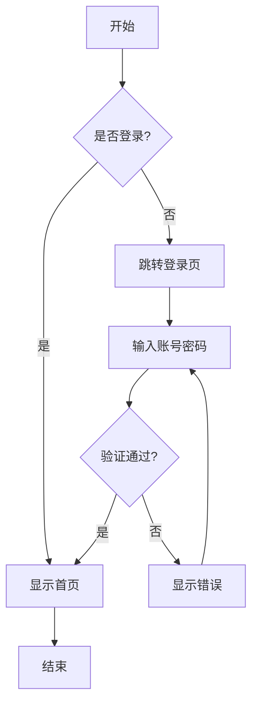
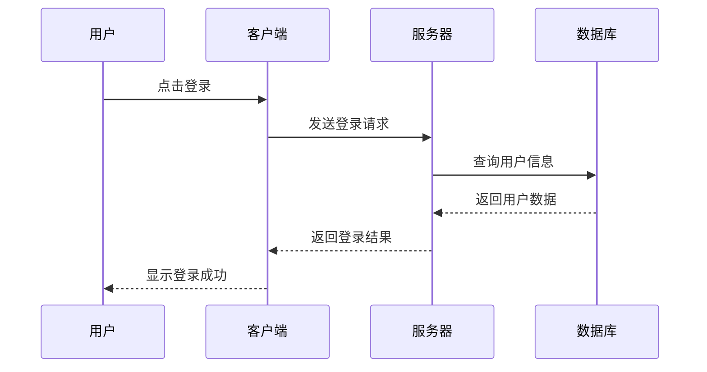
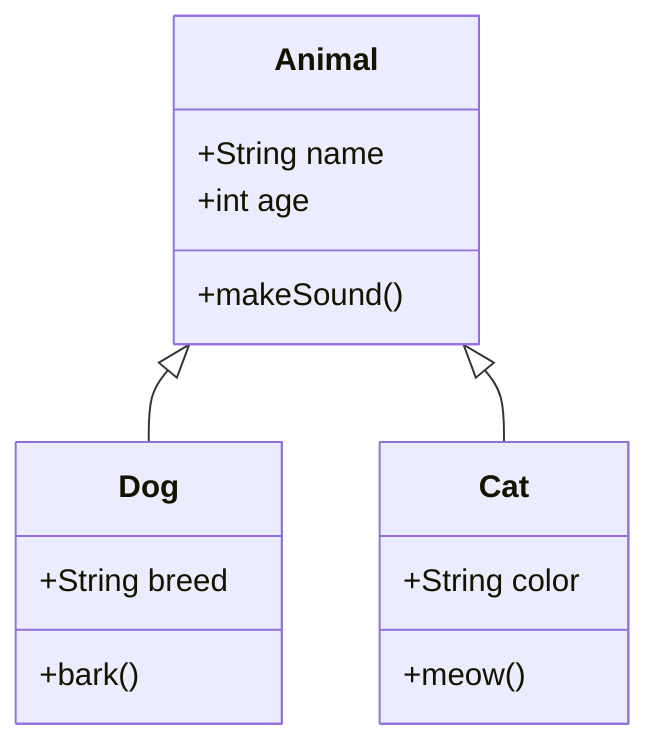
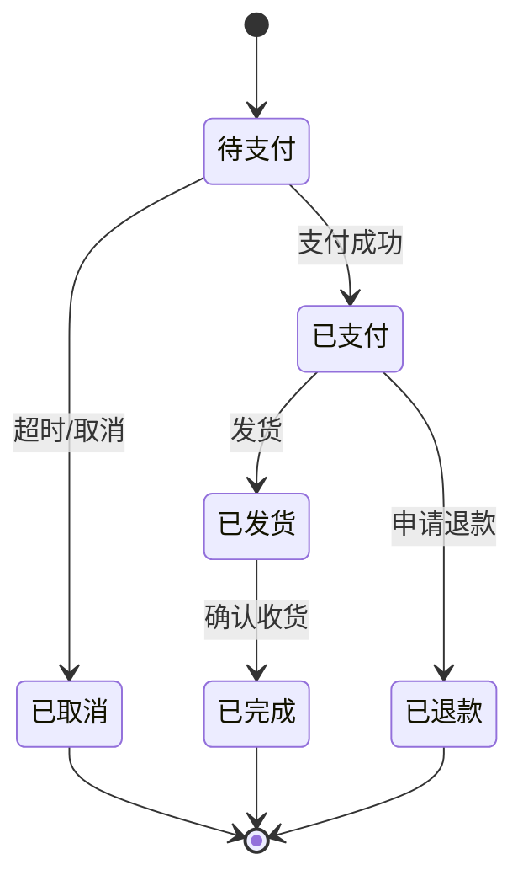
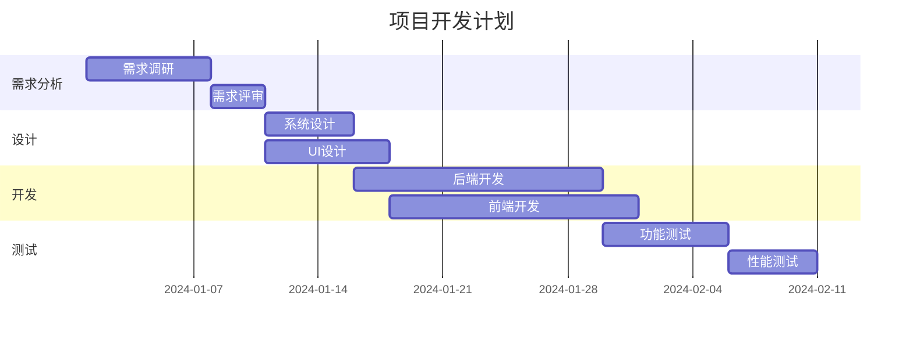
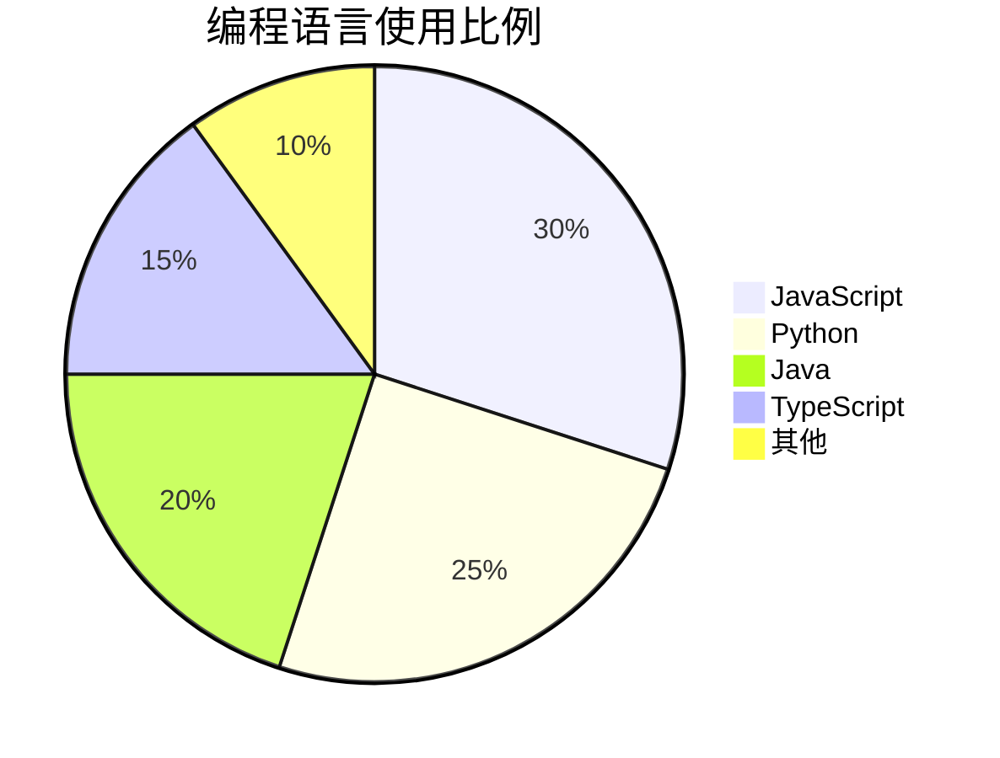

# Markdown 语法测试文档

这是一份全面的 Markdown 语法测试文档，涵盖了标准 Markdown、GFM (GitHub Flavored Markdown) 以及常见扩展语法。本文档可用于测试 Markdown 渲染器的兼容性和正确性。

---

## 目录

1. [标题语法](#标题语法)
2. [段落与换行](#段落与换行)
3. [强调语法](#强调语法)
4. [列表](#列表)
5. [链接与图片](#链接与图片)
6. [代码](#代码)
7. [引用](#引用)
8. [表格](#表格)
9. [水平分隔线](#水平分隔线)
10. [任务列表](#任务列表)
11. [数学公式](#数学公式)
12. [脚注](#脚注)
13. [定义列表](#定义列表)
14. [缩写](#缩写)
15. [自定义容器](#自定义容器)
16. [HTML 标签](#html-标签)
17. [特殊字符转义](#特殊字符转义)
18. [综合测试案例](#综合测试案例)

---

## 标题语法

Markdown 支持两种标题语法：Setext 形式和 Atx 形式。

### Atx 形式标题

# 一级标题 H1
## 二级标题 H2
### 三级标题 H3
#### 四级标题 H4
##### 五级标题 H5
###### 六级标题 H6

### Setext 形式标题

一级标题
========

二级标题
--------

### 标题中的特殊内容

# 标题中包含 `代码`
## 标题中包含 **粗体** 和 *斜体*
### 标题中包含 [链接](https://example.com)
#### 标题中包含 ~~删除线~~
##### 标题中包含数学公式 $E=mc^2$
###### 标题中包含 emoji 🎉

---

## 段落与换行

这是第一个段落。Markdown 中的段落由一个或多个连续的文本行组成，段落之间通过一个或多个空行分隔。

这是第二个段落。在 Markdown 中，如果你想在段落内进行换行（软换行），你需要在行尾添加两个或更多空格，然后按回车键。

这是一行文字。  
这是换行后的文字（使用了行尾双空格）。

这是使用 HTML 标签换行的示例。<br>
这是换行后的内容。

### 长段落测试

Lorem ipsum dolor sit amet, consectetur adipiscing elit. Sed do eiusmod tempor incididunt ut labore et dolore magna aliqua. Ut enim ad minim veniam, quis nostrud exercitation ullamco laboris nisi ut aliquip ex ea commodo consequat. Duis aute irure dolor in reprehenderit in voluptate velit esse cillum dolore eu fugiat nulla pariatur. Excepteur sint occaecat cupidatat non proident, sunt in culpa qui officia deserunt mollit anim id est laborum.

软件开发是一项复杂的工程活动，它涉及到需求分析、系统设计、编码实现、测试验证、部署上线以及后续的维护和优化等多个阶段。在整个软件开发生命周期中，每个阶段都有其特定的目标、方法和产出物。需求分析阶段的主要目标是明确用户的真实需求，并将这些需求转化为可执行的技术规范。系统设计阶段则需要根据需求规范，设计出合理的系统架构和模块划分。编码实现阶段是将设计转化为可运行代码的过程，这个阶段需要程序员具备扎实的编程技能和良好的编码规范。测试验证阶段的目的是确保软件的质量满足预期要求，包括功能测试、性能测试、安全测试等多个方面。部署上线阶段需要将经过测试的软件发布到生产环境中，供最终用户使用。维护和优化阶段则是一个持续的过程，需要根据用户反馈和业务发展不断对软件进行改进和完善。

---

## 强调语法

### 斜体

*这是斜体文字* 使用单个星号包围
_这也是斜体文字_ 使用单个下划线包围

### 粗体

**这是粗体文字** 使用两个星号包围
__这也是粗体文字__ 使用两个下划线包围

### 粗斜体

***这是粗斜体文字*** 使用三个星号包围
___这也是粗斜体文字___ 使用三个下划线包围
**_这也是粗斜体_** 混合使用
*__这还是粗斜体__* 另一种混合方式

### 删除线

~~这是删除线文字~~

### 高亮

==这是高亮文字==（需要扩展支持）

### 下划线

++这是下划线文字++（需要扩展支持）

### 上标和下标

这是上标文字：X^2^ + Y^2^ = Z^2^
这是下标文字：H~2~O 是水的化学式

### 组合使用

这段文字展示了**粗体**、*斜体*、~~删除线~~和 `行内代码` 的组合使用。

在一个句子中，你可以混合使用各种格式：**这是粗体**，*这是斜体*，***这是粗斜体***，~~这是删除线~~，`这是代码`，==这是高亮==。

---

## 列表

### 无序列表

使用星号：
* 项目一
* 项目二
* 项目三

使用加号：
+ 项目一
+ 项目二
+ 项目三

使用减号：
- 项目一
- 项目二
- 项目三

### 有序列表

1. 第一项
2. 第二项
3. 第三项

使用相同数字：
1. 第一项
1. 第二项
1. 第三项

从其他数字开始：
5. 第五项
6. 第六项
7. 第七项

### 嵌套列表

- 一级项目 A
  - 二级项目 A1
  - 二级项目 A2
    - 三级项目 A2a
    - 三级项目 A2b
  - 二级项目 A3
- 一级项目 B
  - 二级项目 B1

1. 一级有序项目
   1. 二级有序项目
   2. 二级有序项目
      1. 三级有序项目
      2. 三级有序项目
2. 一级有序项目

### 混合嵌套列表

1. 有序项目一
   - 无序子项目
   - 无序子项目
2. 有序项目二
   1. 有序子项目
   2. 有序子项目
3. 有序项目三

- 无序项目一
  1. 有序子项目
  2. 有序子项目
- 无序项目二

### 列表中包含其他元素

- 这是一个列表项

  这是列表项中的段落。注意缩进。

- 这是另一个列表项

  > 这是列表项中的引用

- 这是第三个列表项

  ```python
  # 这是列表项中的代码块
  def hello():
      print("Hello, World!")
  ```

- 这是第四个列表项

  | 表头1 | 表头2 |
  |-------|-------|
  | 单元格1 | 单元格2 |

---

## 链接与图片

### 行内链接

[百度](https://www.baidu.com)
[Google](https://www.google.com "Google 搜索引擎")

### 参考链接

[百度][baidu]
[Google][google]
[GitHub][1]

[baidu]: https://www.baidu.com
[google]: https://www.google.com "Google 搜索引擎"
[1]: https://github.com

### 自动链接

<https://www.example.com>
<user@example.com>

### 图片

行内图片：


参考图片：
![替代文本][placeholder]

[placeholder]: https://via.placeholder.com/150 "图片标题"

### 带链接的图片

[](https://www.example.com)

### 图片尺寸（扩展语法）


---

## 代码

### 行内代码

这是 `行内代码` 的示例。

使用 `console.log()` 输出日志。

如果代码中包含反引号，可以使用双反引号：`` `code` ``

### 代码块（缩进方式）

    function hello() {
        console.log("Hello, World!");
    }

### 围栏代码块

```
这是一个没有指定语言的代码块
```

```javascript
// JavaScript 代码
function fibonacci(n) {
    if (n <= 1) return n;
    return fibonacci(n - 1) + fibonacci(n - 2);
}

console.log(fibonacci(10)); // 输出: 55
```

```python
# Python 代码
def quicksort(arr):
    if len(arr) <= 1:
        return arr
    pivot = arr[len(arr) // 2]
    left = [x for x in arr if x < pivot]
    middle = [x for x in arr if x == pivot]
    right = [x for x in arr if x > pivot]
    return quicksort(left) + middle + quicksort(right)

print(quicksort([3, 6, 8, 10, 1, 2, 1]))
```

```java
// Java 代码
public class HelloWorld {
    public static void main(String[] args) {
        System.out.println("Hello, World!");
        
        // 计算阶乘
        int n = 5;
        int factorial = 1;
        for (int i = 1; i <= n; i++) {
            factorial *= i;
        }
        System.out.println("5! = " + factorial);
    }
}
```

```typescript
// TypeScript 代码
interface User {
    id: number;
    name: string;
    email: string;
    age?: number;
}

class UserService {
    private users: User[] = [];

    addUser(user: User): void {
        this.users.push(user);
    }

    getUserById(id: number): User | undefined {
        return this.users.find(user => user.id === id);
    }

    getAllUsers(): User[] {
        return [...this.users];
    }
}

const service = new UserService();
service.addUser({ id: 1, name: "张三", email: "zhangsan@example.com" });
console.log(service.getAllUsers());
```

```go
// Go 代码
package main

import (
    "fmt"
    "sync"
)

func main() {
    var wg sync.WaitGroup
    ch := make(chan int, 10)

    // 生产者
    wg.Add(1)
    go func() {
        defer wg.Done()
        for i := 0; i < 10; i++ {
            ch <- i
        }
        close(ch)
    }()

    // 消费者
    wg.Add(1)
    go func() {
        defer wg.Done()
        for num := range ch {
            fmt.Printf("Received: %d\n", num)
        }
    }()

    wg.Wait()
}
```

```rust
// Rust 代码
use std::collections::HashMap;

fn main() {
    let mut scores: HashMap<String, i32> = HashMap::new();
    
    scores.insert(String::from("Blue"), 10);
    scores.insert(String::from("Yellow"), 50);
    
    for (key, value) in &scores {
        println!("{}: {}", key, value);
    }
    
    // 模式匹配
    let score = scores.get("Blue");
    match score {
        Some(s) => println!("Blue team score: {}", s),
        None => println!("Blue team not found"),
    }
}
```

```sql
-- SQL 代码
-- 创建用户表
CREATE TABLE users (
    id INT PRIMARY KEY AUTO_INCREMENT,
    username VARCHAR(50) NOT NULL UNIQUE,
    email VARCHAR(100) NOT NULL,
    password_hash VARCHAR(255) NOT NULL,
    created_at TIMESTAMP DEFAULT CURRENT_TIMESTAMP,
    updated_at TIMESTAMP DEFAULT CURRENT_TIMESTAMP ON UPDATE CURRENT_TIMESTAMP
);

-- 创建订单表
CREATE TABLE orders (
    id INT PRIMARY KEY AUTO_INCREMENT,
    user_id INT NOT NULL,
    total_amount DECIMAL(10, 2) NOT NULL,
    status ENUM('pending', 'paid', 'shipped', 'completed', 'cancelled') DEFAULT 'pending',
    created_at TIMESTAMP DEFAULT CURRENT_TIMESTAMP,
    FOREIGN KEY (user_id) REFERENCES users(id)
);

-- 查询用户订单
SELECT 
    u.username,
    COUNT(o.id) as order_count,
    SUM(o.total_amount) as total_spent
FROM users u
LEFT JOIN orders o ON u.id = o.user_id
GROUP BY u.id, u.username
HAVING total_spent > 1000
ORDER BY total_spent DESC;
```

```bash
#!/bin/bash
# Bash 脚本

# 变量定义
NAME="World"
echo "Hello, $NAME!"

# 条件判断
if [ -f "/etc/passwd" ]; then
    echo "文件存在"
else
    echo "文件不存在"
fi

# 循环
for i in {1..5}; do
    echo "Number: $i"
done

# 函数
function greet() {
    local name=$1
    echo "Hello, $name!"
}

greet "Alice"
greet "Bob"
```

```yaml
# YAML 配置文件
version: '3.8'

services:
  web:
    build: .
    ports:
      - "5000:5000"
    volumes:
      - .:/code
    environment:
      - FLASK_ENV=development
      - DATABASE_URL=postgresql://user:pass@db:5432/mydb
    depends_on:
      - db
      - redis

  db:
    image: postgres:13
    volumes:
      - postgres_data:/var/lib/postgresql/data
    environment:
      - POSTGRES_USER=user
      - POSTGRES_PASSWORD=pass
      - POSTGRES_DB=mydb

  redis:
    image: redis:alpine
    ports:
      - "6379:6379"

volumes:
  postgres_data:
```

```json
{
  "name": "markdown-test",
  "version": "1.0.0",
  "description": "Markdown 测试项目",
  "main": "index.js",
  "scripts": {
    "start": "node index.js",
    "dev": "nodemon index.js",
    "test": "jest",
    "build": "webpack --mode production"
  },
  "dependencies": {
    "express": "^4.18.2",
    "lodash": "^4.17.21",
    "axios": "^1.4.0"
  },
  "devDependencies": {
    "jest": "^29.5.0",
    "nodemon": "^2.0.22",
    "webpack": "^5.88.0"
  },
  "author": "Test Author",
  "license": "MIT"
}
```

```css
/* CSS 样式 */
:root {
  --primary-color: #007bff;
  --secondary-color: #6c757d;
  --success-color: #28a745;
  --danger-color: #dc3545;
  --font-family: 'Segoe UI', Tahoma, Geneva, Verdana, sans-serif;
}

* {
  margin: 0;
  padding: 0;
  box-sizing: border-box;
}

body {
  font-family: var(--font-family);
  line-height: 1.6;
  color: #333;
  background-color: #f4f4f4;
}

.container {
  max-width: 1200px;
  margin: 0 auto;
  padding: 0 20px;
}

.btn {
  display: inline-block;
  padding: 10px 20px;
  border: none;
  border-radius: 5px;
  cursor: pointer;
  transition: all 0.3s ease;
}

.btn-primary {
  background-color: var(--primary-color);
  color: white;
}

.btn-primary:hover {
  background-color: #0056b3;
  transform: translateY(-2px);
  box-shadow: 0 4px 6px rgba(0, 0, 0, 0.1);
}

@media (max-width: 768px) {
  .container {
    padding: 0 10px;
  }
}
```

```html
<!DOCTYPE html>
<html lang="zh-CN">
<head>
    <meta charset="UTF-8">
    <meta name="viewport" content="width=device-width, initial-scale=1.0">
    <title>Markdown 测试页面</title>
    <link rel="stylesheet" href="styles.css">
</head>
<body>
    <header class="header">
        <nav class="navbar">
            <a href="#" class="logo">Logo</a>
            <ul class="nav-links">
                <li><a href="#home">首页</a></li>
                <li><a href="#about">关于</a></li>
                <li><a href="#services">服务</a></li>
                <li><a href="#contact">联系</a></li>
            </ul>
        </nav>
    </header>
    
    <main class="main-content">
        <section id="home" class="hero">
            <h1>欢迎来到我们的网站</h1>
            <p>这是一个用于测试 Markdown 渲染的示例页面</p>
            <button class="btn btn-primary">了解更多</button>
        </section>
    </main>
    
    <footer class="footer">
        <p>&copy; 2024 Markdown Test. All rights reserved.</p>
    </footer>
    
    <script src="script.js"></script>
</body>
</html>
```

```vue
<template>
  <div class="user-profile">
    <header class="profile-header">
      
      <h1>{{ user.name }}</h1>
      <p class="bio">{{ user.bio }}</p>
    </header>
    
    <section class="profile-stats">
      <div class="stat" v-for="stat in stats" :key="stat.label">
        <span class="stat-value">{{ stat.value }}</span>
        <span class="stat-label">{{ stat.label }}</span>
      </div>
    </section>
    
    <section class="profile-actions">
      <button @click="followUser" :class="{ following: isFollowing }">
        {{ isFollowing ? '已关注' : '关注' }}
      </button>
      <button @click="sendMessage">发送消息</button>
    </section>
  </div>
</template>

<script setup lang="ts">
import { ref, computed } from 'vue';

interface User {
  id: number;
  name: string;
  avatar: string;
  bio: string;
  followers: number;
  following: number;
  posts: number;
}

const props = defineProps<{
  user: User;
}>();

const isFollowing = ref(false);

const stats = computed(() => [
  { label: '粉丝', value: props.user.followers },
  { label: '关注', value: props.user.following },
  { label: '帖子', value: props.user.posts },
]);

const followUser = () => {
  isFollowing.value = !isFollowing.value;
};

const sendMessage = () => {
  console.log('发送消息给', props.user.name);
};
</script>

<style scoped>
.user-profile {
  max-width: 600px;
  margin: 0 auto;
  padding: 20px;
}

.profile-header {
  text-align: center;
  margin-bottom: 20px;
}

.avatar {
  width: 120px;
  height: 120px;
  border-radius: 50%;
  object-fit: cover;
}

.profile-stats {
  display: flex;
  justify-content: space-around;
  margin-bottom: 20px;
}

.stat {
  text-align: center;
}

.stat-value {
  display: block;
  font-size: 24px;
  font-weight: bold;
}

.profile-actions {
  display: flex;
  gap: 10px;
  justify-content: center;
}

.following {
  background-color: #28a745;
}
</style>
```

---

## 引用

### 基本引用

> 这是一段引用文字。

> 这是一段多行引用文字。
> 
> 引用可以包含多个段落。

### 嵌套引用

> 这是第一层引用
>
> > 这是第二层嵌套引用
> >
> > > 这是第三层嵌套引用

### 引用中包含其他元素

> ### 引用中的标题
>
> 引用中可以包含各种 Markdown 元素：
>
> - 列表项一
> - 列表项二
>
> 也可以包含代码：
>
> ```javascript
> console.log("引用中的代码");
> ```
>
> 还可以包含**粗体**和*斜体*文字。

### 名人名言

> "生活就像一盒巧克力，你永远不知道下一颗是什么味道。"
> 
> — 阿甘正传

> "Stay hungry, stay foolish."
> 
> — Steve Jobs

> "代码是写给人看的，附带能在机器上运行。"
> 
> — Harold Abelson

---

## 表格

### 基本表格

| 姓名 | 年龄 | 职业 |
|------|------|------|
| 张三 | 25 | 工程师 |
| 李四 | 30 | 设计师 |
| 王五 | 28 | 产品经理 |

### 对齐方式

| 左对齐 | 居中对齐 | 右对齐 |
|:-------|:--------:|-------:|
| 内容 | 内容 | 内容 |
| 左 | 中 | 右 |
| 文本 | 文本 | 文本 |

### 复杂表格

| 功能 | 基础版 | 专业版 | 企业版 |
|:-----|:------:|:------:|:------:|
| 用户数量 | 10 | 100 | 无限 |
| 存储空间 | 5GB | 50GB | 500GB |
| API 调用 | 1000/月 | 10000/月 | 无限 |
| 技术支持 | 邮件 | 邮件+电话 | 24/7 专属 |
| 价格 | 免费 | ¥99/月 | ¥999/月 |

### 表格中包含其他元素

| 语法 | 示例 | 说明 |
|------|------|------|
| 粗体 | **粗体文字** | 使用双星号 |
| 斜体 | *斜体文字* | 使用单星号 |
| 代码 | `code` | 使用反引号 |
| 链接 | [链接](https://example.com) | 方括号加圆括号 |
| 删除线 | ~~删除~~ | 使用双波浪号 |

### 宽表格测试

| 列1 | 列2 | 列3 | 列4 | 列5 | 列6 | 列7 | 列8 | 列9 | 列10 |
|-----|-----|-----|-----|-----|-----|-----|-----|-----|------|
| A1 | A2 | A3 | A4 | A5 | A6 | A7 | A8 | A9 | A10 |
| B1 | B2 | B3 | B4 | B5 | B6 | B7 | B8 | B9 | B10 |
| C1 | C2 | C3 | C4 | C5 | C6 | C7 | C8 | C9 | C10 |

### 长内容表格

| 名称 | 描述 |
|------|------|
| Vue.js | Vue.js 是一款用于构建用户界面的 JavaScript 框架。它基于标准 HTML、CSS 和 JavaScript 构建，并提供了一套声明式的、组件化的编程模型，帮助你高效地开发用户界面。 |
| React | React 是一个用于构建用户界面的 JavaScript 库。它由 Facebook 开发和维护，允许开发者创建大型 web 应用，这些应用可以在数据变化时高效地更新和渲染。 |
| Angular | Angular 是一个用于构建移动和桌面 Web 应用程序的平台。它使用 TypeScript 来实现，并通过依赖注入、端到端工具和集成的最佳实践来解决开发者在构建应用程序时面临的挑战。 |

---

## 水平分隔线

使用三个或更多的星号：

***

使用三个或更多的减号：

---

使用三个或更多的下划线：

___

---

## 任务列表

### 基本任务列表

- [x] 已完成的任务
- [x] 另一个已完成的任务
- [ ] 未完成的任务
- [ ] 还有一个未完成的任务

### 项目任务清单

- [ ] **项目初始化**
  - [x] 创建项目仓库
  - [x] 初始化 package.json
  - [ ] 配置 ESLint
  - [ ] 配置 Prettier
- [ ] **功能开发**
  - [ ] 用户认证模块
    - [x] 登录功能
    - [x] 注册功能
    - [ ] 忘记密码
    - [ ] 第三方登录
  - [ ] 数据管理模块
    - [ ] CRUD 操作
    - [ ] 数据导入导出
- [ ] **测试**
  - [ ] 单元测试
  - [ ] 集成测试
  - [ ] E2E 测试
- [ ] **部署**
  - [ ] 配置 CI/CD
  - [ ] 部署到测试环境
  - [ ] 部署到生产环境

---

## 数学公式

### 行内公式

爱因斯坦的质能方程：$E = mc^2$

勾股定理：$a^2 + b^2 = c^2$

一元二次方程求根公式：$x = \frac{-b \pm \sqrt{b^2 - 4ac}}{2a}$

欧拉公式：$e^{i\pi} + 1 = 0$

### 块级公式

二次方程的求根公式：

$$
x = \frac{-b \pm \sqrt{b^2 - 4ac}}{2a}
$$

高斯分布（正态分布）：

$$
f(x) = \frac{1}{\sigma\sqrt{2\pi}} e^{-\frac{(x-\mu)^2}{2\sigma^2}}
$$

麦克斯韦方程组：

$$
\begin{aligned}
\nabla \cdot \mathbf{E} &= \frac{\rho}{\varepsilon_0} \\
\nabla \cdot \mathbf{B} &= 0 \\
\nabla \times \mathbf{E} &= -\frac{\partial \mathbf{B}}{\partial t} \\
\nabla \times \mathbf{B} &= \mu_0 \mathbf{J} + \mu_0 \varepsilon_0 \frac{\partial \mathbf{E}}{\partial t}
\end{aligned}
$$

泰勒展开式：

$$
f(x) = f(a) + f'(a)(x-a) + \frac{f''(a)}{2!}(x-a)^2 + \frac{f'''(a)}{3!}(x-a)^3 + \cdots
$$

矩阵运算：

$$
\begin{pmatrix}
a_{11} & a_{12} & a_{13} \\
a_{21} & a_{22} & a_{23} \\
a_{31} & a_{32} & a_{33}
\end{pmatrix}
\begin{pmatrix}
x_1 \\
x_2 \\
x_3
\end{pmatrix}
=
\begin{pmatrix}
b_1 \\
b_2 \\
b_3
\end{pmatrix}
$$

求和公式：

$$
\sum_{i=1}^{n} i = \frac{n(n+1)}{2}
$$

积分公式：

$$
\int_{0}^{\infty} e^{-x^2} dx = \frac{\sqrt{\pi}}{2}
$$

极限：

$$
\lim_{n \to \infty} \left(1 + \frac{1}{n}\right)^n = e
$$

### 复杂公式示例

薛定谔方程：

$$
i\hbar\frac{\partial}{\partial t}\Psi(\mathbf{r},t) = \left[-\frac{\hbar^2}{2m}\nabla^2 + V(\mathbf{r},t)\right]\Psi(\mathbf{r},t)
$$

傅里叶变换：

$$
\hat{f}(\xi) = \int_{-\infty}^{\infty} f(x) e^{-2\pi i x \xi} dx
$$

贝叶斯定理：

$$
P(A|B) = \frac{P(B|A) \cdot P(A)}{P(B)}
$$

信息熵：

$$
H(X) = -\sum_{i=1}^{n} P(x_i) \log_2 P(x_i)
$$

---

## 脚注

这是一个带脚注的文本[^1]。

这是另一个带脚注的文本[^2]。

你也可以使用更长的脚注标识符[^longnote]。

还可以使用内联脚注^[这是一个内联脚注，内容写在方括号中]。

[^1]: 这是第一个脚注的内容。

[^2]: 这是第二个脚注的内容，可以包含多行。

    第二行内容。

[^longnote]: 这是一个较长的脚注。

    它可以包含多个段落。

    还可以包含代码块：

    ```python
    print("Hello from footnote!")
    ```

---

## 定义列表

术语 1
: 术语 1 的定义

术语 2
: 术语 2 的第一个定义
: 术语 2 的第二个定义

编程语言
: 一种用于编写计算机程序的形式语言
: 常见的编程语言包括 Python、JavaScript、Java 等

算法
: 解决特定问题的一系列步骤
: 算法应该具有有限性、确定性、输入、输出和有效性

数据结构
: 组织和存储数据的方式
: 常见的数据结构包括数组、链表、栈、队列、树、图等

---

## 缩写

HTML 规范由 W3C 维护。

*[HTML]: Hyper Text Markup Language
*[W3C]: World Wide Web Consortium

CSS 用于描述 HTML 文档的样式。

*[CSS]: Cascading Style Sheets

---

## 自定义容器

::: tip 提示
这是一个提示容器，用于显示提示信息。
:::

::: warning 警告
这是一个警告容器，用于显示警告信息。
:::

::: danger 危险
这是一个危险容器，用于显示危险警告。
:::

::: info 信息
这是一个信息容器，用于显示一般信息。
:::

::: details 点击展开详情
这是可折叠的详情内容。

你可以在这里放置任何内容：

- 列表
- 代码块
- 表格

```javascript
console.log("详情中的代码");
```
:::

---

## HTML 标签

### 基本 HTML

<div style="background-color: #f0f0f0; padding: 10px; border-radius: 5px;">
这是一个使用 HTML 的 div 容器。
</div>

<p style="color: blue; font-weight: bold;">这是蓝色粗体文字。</p>

### 键盘按键

使用 <kbd>Ctrl</kbd> + <kbd>C</kbd> 复制。

使用 <kbd>Ctrl</kbd> + <kbd>V</kbd> 粘贴。

使用 <kbd>Ctrl</kbd> + <kbd>Z</kbd> 撤销。

### 上标和下标

水的化学式是 H<sub>2</sub>O。

爱因斯坦的公式是 E = mc<sup>2</sup>。

### 标记

这是一段包含 <mark>高亮标记</mark> 的文字。

### 缩写

<abbr title="Hyper Text Markup Language">HTML</abbr> 是网页的标准标记语言。

### 引用和作品

<q>这是短引用。</q>

<blockquote cite="https://www.example.com">
这是块引用，来自某个来源。
</blockquote>

<cite>《三体》</cite> 是刘慈欣的代表作品。

### 时间

会议时间：<time datetime="2024-01-15T14:00:00">2024年1月15日 14:00</time>

### 进度条

下载进度：<progress value="70" max="100">70%</progress>

### 详情/摘要

<details>
<summary>点击展开更多内容</summary>

这是隐藏的详细内容。

- 项目一
- 项目二
- 项目三

</details>

---

## 特殊字符转义

### 需要转义的字符

\\ 反斜杠
\` 反引号
\* 星号
\_ 下划线
\{\} 花括号
\[\] 方括号
\(\) 圆括号
\# 井号
\+ 加号
\- 减号
\. 点号
\! 感叹号
\| 管道符

### 实体字符

&copy; &reg; &trade; &amp; &lt; &gt; &nbsp; &quot;

### Unicode 字符

常用符号：© ® ™ € £ ¥ § ¶ † ‡

箭头：← → ↑ ↓ ↔ ⇐ ⇒ ⇑ ⇓ ⇔

数学符号：± × ÷ ≠ ≤ ≥ ≈ ∞ ∑ ∏ ∫ √ ∂ ∆ ∇

希腊字母：α β γ δ ε ζ η θ ι κ λ μ ν ξ ο π ρ σ τ υ φ χ ψ ω

---

## 综合测试案例

### 案例一：技术文档

#### API 接口文档

**接口名称**：获取用户信息

**请求方式**：`GET`

**请求地址**：`/api/v1/users/{id}`

**请求参数**：

| 参数名 | 类型 | 必填 | 说明 |
|--------|------|------|------|
| id | integer | 是 | 用户 ID |

**响应示例**：

```json
{
  "code": 200,
  "message": "success",
  "data": {
    "id": 1,
    "username": "zhangsan",
    "email": "zhangsan@example.com",
    "avatar": "https://example.com/avatar.jpg",
    "created_at": "2024-01-01T00:00:00Z"
  }
}
```

**错误码**：

| 错误码 | 说明 |
|--------|------|
| 400 | 请求参数错误 |
| 401 | 未授权 |
| 404 | 用户不存在 |
| 500 | 服务器内部错误 |

> **注意**：调用此接口需要在请求头中携带有效的 `Authorization` 令牌。

---

### 案例二：数学证明

#### 证明：$\sqrt{2}$ 是无理数

**定理**：$\sqrt{2}$ 不能表示为两个整数的比值。

**证明**：使用反证法。

假设 $\sqrt{2}$ 是有理数，则存在互质的整数 $p$ 和 $q$（$q \neq 0$），使得：

$$
\sqrt{2} = \frac{p}{q}
$$

两边平方得：

$$
2 = \frac{p^2}{q^2}
$$

即：

$$
p^2 = 2q^2
$$

这说明 $p^2$ 是偶数，因此 $p$ 也是偶数。设 $p = 2k$，代入上式：

$$
4k^2 = 2q^2
$$

即：

$$
q^2 = 2k^2
$$

这说明 $q^2$ 是偶数，因此 $q$ 也是偶数。

但是，$p$ 和 $q$ 同时为偶数与它们互质的假设矛盾。

因此，$\sqrt{2}$ 是无理数。$\blacksquare$

---

### 案例三：代码教程

#### Python 快速入门

Python 是一种简单易学的编程语言，适合初学者入门。

##### 1. Hello World

```python
print("Hello, World!")
```

##### 2. 变量和数据类型

```python
# 整数
age = 25

# 浮点数
price = 19.99

# 字符串
name = "张三"

# 布尔值
is_student = True

# 列表
fruits = ["苹果", "香蕉", "橙子"]

# 字典
person = {
    "name": "张三",
    "age": 25,
    "city": "北京"
}
```

##### 3. 条件语句

```python
score = 85

if score >= 90:
    grade = "优秀"
elif score >= 80:
    grade = "良好"
elif score >= 60:
    grade = "及格"
else:
    grade = "不及格"

print(f"成绩等级：{grade}")
```

##### 4. 循环语句

```python
# for 循环
for i in range(5):
    print(f"第 {i + 1} 次循环")

# while 循环
count = 0
while count < 5:
    print(f"计数：{count}")
    count += 1

# 遍历列表
fruits = ["苹果", "香蕉", "橙子"]
for fruit in fruits:
    print(fruit)
```

##### 5. 函数定义

```python
def greet(name, greeting="你好"):
    """
    问候函数
    
    参数:
        name: 姓名
        greeting: 问候语，默认为"你好"
    
    返回:
        问候字符串
    """
    return f"{greeting}，{name}！"

# 调用函数
message = greet("张三")
print(message)  # 输出：你好，张三！

message = greet("李四", "早上好")
print(message)  # 输出：早上好，李四！
```

##### 6. 类和对象

```python
class Person:
    """人类"""
    
    def __init__(self, name, age):
        self.name = name
        self.age = age
    
    def introduce(self):
        return f"我叫{self.name}，今年{self.age}岁。"
    
    def have_birthday(self):
        self.age += 1
        print(f"生日快乐！{self.name}现在{self.age}岁了。")

# 创建对象
person = Person("张三", 25)
print(person.introduce())
person.have_birthday()
```

---

### 案例四：项目文档

#### 项目名称：在线书店系统

##### 项目概述

这是一个功能完整的在线书店系统，支持用户浏览书籍、购买书籍、管理订单等功能。

##### 技术栈

- **前端**：Vue 3 + TypeScript + Vite
- **后端**：Node.js + Express + TypeScript
- **数据库**：PostgreSQL + Redis
- **部署**：Docker + Kubernetes

##### 功能模块

1. **用户模块**
   - [x] 用户注册
   - [x] 用户登录
   - [x] 个人信息管理
   - [ ] 第三方登录（微信、GitHub）

2. **书籍模块**
   - [x] 书籍列表
   - [x] 书籍详情
   - [x] 书籍搜索
   - [x] 书籍分类

3. **购物车模块**
   - [x] 添加到购物车
   - [x] 修改数量
   - [x] 删除商品
   - [x] 结算

4. **订单模块**
   - [x] 创建订单
   - [x] 支付订单
   - [x] 订单列表
   - [ ] 订单评价

##### 数据库设计

```sql
-- 用户表
CREATE TABLE users (
    id SERIAL PRIMARY KEY,
    username VARCHAR(50) UNIQUE NOT NULL,
    email VARCHAR(100) UNIQUE NOT NULL,
    password_hash VARCHAR(255) NOT NULL,
    avatar VARCHAR(255),
    created_at TIMESTAMP DEFAULT CURRENT_TIMESTAMP
);

-- 书籍表
CREATE TABLE books (
    id SERIAL PRIMARY KEY,
    title VARCHAR(200) NOT NULL,
    author VARCHAR(100) NOT NULL,
    isbn VARCHAR(13) UNIQUE,
    price DECIMAL(10, 2) NOT NULL,
    stock INTEGER DEFAULT 0,
    category_id INTEGER REFERENCES categories(id),
    description TEXT,
    cover_image VARCHAR(255),
    created_at TIMESTAMP DEFAULT CURRENT_TIMESTAMP
);

-- 订单表
CREATE TABLE orders (
    id SERIAL PRIMARY KEY,
    user_id INTEGER REFERENCES users(id),
    total_amount DECIMAL(10, 2) NOT NULL,
    status VARCHAR(20) DEFAULT 'pending',
    shipping_address TEXT,
    created_at TIMESTAMP DEFAULT CURRENT_TIMESTAMP
);
```

##### API 接口列表

| 方法 | 路径 | 说明 |
|------|------|------|
| POST | /api/auth/register | 用户注册 |
| POST | /api/auth/login | 用户登录 |
| GET | /api/books | 获取书籍列表 |
| GET | /api/books/:id | 获取书籍详情 |
| POST | /api/cart/add | 添加到购物车 |
| GET | /api/cart | 获取购物车 |
| POST | /api/orders | 创建订单 |
| GET | /api/orders | 获取订单列表 |

##### 快速开始

1. 克隆仓库：

```bash
git clone https://github.com/example/online-bookstore.git
cd online-bookstore
```

2. 安装依赖：

```bash
# 安装后端依赖
cd backend
npm install

# 安装前端依赖
cd ../frontend
npm install
```

3. 配置环境变量：

```bash
cp .env.example .env
# 编辑 .env 文件，填入必要的配置
```

4. 启动开发服务器：

```bash
# 启动后端
cd backend
npm run dev

# 启动前端
cd ../frontend
npm run dev
```

5. 访问应用：

打开浏览器访问 http://localhost:3000

---

### 案例五：会议纪要

#### 产品周会纪要

**会议时间**：2024年1月15日 14:00-15:30

**会议地点**：三楼会议室 / 腾讯会议

**参会人员**：张三（主持）、李四、王五、赵六、钱七

**会议议题**：

1. 上周工作回顾
2. 本周工作计划
3. 问题讨论

---

##### 一、上周工作回顾

| 成员 | 完成事项 | 完成度 |
|------|----------|--------|
| 李四 | 用户认证模块开发 | 100% |
| 王五 | 首页 UI 设计稿 | 100% |
| 赵六 | API 接口文档编写 | 80% |
| 钱七 | 测试用例编写 | 90% |

**主要成果**：

- [x] 完成用户登录、注册功能
- [x] 完成首页设计稿评审
- [ ] API 文档还需补充错误码说明
- [ ] 测试用例需补充边界条件测试

##### 二、本周工作计划

1. **李四**
   - 完成购物车模块开发
   - 预计工作量：3天

2. **王五**
   - 完成商品详情页设计
   - 开始订单页面设计
   - 预计工作量：4天

3. **赵六**
   - 完成 API 文档
   - 开始后端代码审查
   - 预计工作量：3天

4. **钱七**
   - 完成测试用例
   - 开始自动化测试脚本编写
   - 预计工作量：5天

##### 三、问题讨论

> **问题1**：用户头像上传是否需要支持裁剪功能？
> 
> **讨论结果**：需要支持，使用现有的 cropper.js 库实现。
> 
> **负责人**：李四
> 
> **截止时间**：1月18日

> **问题2**：移动端适配优先级如何安排？
> 
> **讨论结果**：优先保证核心功能的移动端适配，包括：
> - 首页
> - 商品列表
> - 商品详情
> - 购物车
> - 结算页
> 
> **负责人**：王五
> 
> **截止时间**：1月25日

##### 四、待办事项

- [ ] 李四：完成头像裁剪功能 @2024-01-18
- [ ] 王五：输出移动端适配方案 @2024-01-17
- [ ] 赵六：补充 API 错误码文档 @2024-01-16
- [ ] 钱七：补充边界条件测试用例 @2024-01-16

---

**下次会议时间**：2024年1月22日 14:00

**会议记录人**：张三

---

## Emoji 表情

### 常用表情

😀 😃 😄 😁 😆 😅 🤣 😂 🙂 🙃 😉 😊 😇 🥰 😍 🤩 😘 😗 ☺️ 😚 😙 🥲

### 手势

👍 👎 👌 🤌 🤏 ✌️ 🤞 🤟 🤘 🤙 👈 👉 👆 👇 ☝️ 👋 🤚 🖐️ ✋ 🖖 👏 🙌 🤝

### 动物

🐶 🐱 🐭 🐹 🐰 🦊 🐻 🐼 🐨 🐯 🦁 🐮 🐷 🐸 🐵 🐔 🐧 🐦 🦆 🦅 🦉 🦇

### 食物

🍎 🍐 🍊 🍋 🍌 🍉 🍇 🍓 🫐 🍈 🍒 🍑 🥭 🍍 🥥 🥝 🍅 🥑 🥦 🥬 🥒 🌶️

### 物品

💻 🖥️ 🖨️ ⌨️ 🖱️ 💾 💿 📱 ☎️ 📞 📟 📠 📺 📻 🎙️ 🎚️ 🎛️ ⏰ ⏱️ ⏲️ 🕰️

### 符号

❤️ 🧡 💛 💚 💙 💜 🖤 🤍 🤎 💔 ❣️ 💕 💞 💓 💗 💖 💘 💝 ⭐ 🌟 ✨ ⚡ 🔥

---

## Mermaid 图表

### 流程图



### 时序图



### 类图



### 状态图



### 甘特图



### 饼图



---

## 长文本测试

以下是用于测试长文本渲染的内容，包含大量中文文字，用于验证渲染器对长文本的处理能力。

### 软件工程概论

软件工程是一门研究用工程化方法构建和维护有效的、实用的和高质量的软件的学科。它涉及到程序设计语言、数据库、软件开发工具、系统平台、标准、设计模式等方面。在现代社会中，软件工程已经成为计算机科学中最重要的分支之一。

软件工程的发展历程可以追溯到二十世纪六十年代。当时，随着计算机技术的快速发展，软件的规模和复杂度不断增加，传统的程序设计方法已经无法满足大型软件开发的需求。于是，人们开始思考如何将工程化的方法应用到软件开发中，软件工程这一学科应运而生。

1968年，NATO（北大西洋公约组织）在德国加米施召开了第一次软件工程会议，正式提出了"软件工程"这一术语。这次会议标志着软件工程作为一门独立学科的诞生。此后，软件工程经历了多个发展阶段，从最初的结构化编程，到面向对象编程，再到如今的敏捷开发和 DevOps，不断演进和完善。

软件工程的核心目标是提高软件质量、降低开发成本、缩短开发周期。为了实现这些目标，软件工程采用了一系列方法、工具和技术。这些方法包括需求分析、系统设计、编码实现、软件测试、项目管理等。每个阶段都有其特定的任务和产出物，共同构成了软件开发的完整生命周期。

需求分析是软件开发的第一步，也是最重要的一步。需求分析的目的是明确用户的真实需求，并将这些需求转化为可执行的技术规范。一个好的需求分析应该做到完整、准确、无歧义。需求分析的结果通常以需求规格说明书的形式呈现，作为后续设计和开发的基础。

系统设计是将需求转化为技术方案的过程。系统设计包括架构设计和详细设计两个层次。架构设计关注系统的整体结构，包括模块划分、接口定义、技术选型等。详细设计则深入到每个模块的内部，设计具体的类、函数、数据结构等。好的设计应该具有高内聚、低耦合的特点，便于后续的开发和维护。

编码实现是将设计转化为可运行代码的过程。这个阶段需要程序员具备扎实的编程技能和良好的编码规范。代码应该清晰、简洁、易于理解和维护。同时，还需要考虑性能、安全性、可扩展性等方面的要求。现代软件开发通常采用版本控制系统来管理代码，使用代码审查来保证代码质量。

软件测试是确保软件质量的重要手段。测试的目的是发现软件中的缺陷，验证软件是否满足需求规格。软件测试包括单元测试、集成测试、系统测试、验收测试等多个层次。每个层次的测试都有其特定的目标和方法。随着自动化测试技术的发展，越来越多的测试工作可以通过自动化脚本来完成，大大提高了测试效率。

项目管理贯穿软件开发的整个过程。好的项目管理可以确保项目按时、按质、按预算完成。项目管理的主要内容包括进度管理、成本管理、质量管理、风险管理、人员管理等。现代软件项目管理通常采用敏捷方法，如 Scrum、Kanban 等，强调迭代开发、持续交付、快速响应变化。

软件维护是软件生命周期中持续时间最长的阶段。据统计，软件维护的成本通常占到软件总成本的60%以上。软件维护包括纠错性维护、适应性维护、完善性维护和预防性维护等类型。为了降低维护成本，在软件开发阶段就应该注重代码质量和文档完整性。

### 人工智能与机器学习

人工智能（Artificial Intelligence，简称 AI）是计算机科学的一个分支，它研究如何使计算机能够模拟、延伸和扩展人的智能。人工智能的研究领域包括机器学习、自然语言处理、计算机视觉、知识表示、推理与规划等多个方面。

机器学习是人工智能的核心技术之一。机器学习的基本思想是通过数据和经验来改进系统的性能，而不是通过显式编程。根据学习方式的不同，机器学习可以分为监督学习、无监督学习、半监督学习和强化学习等类型。

监督学习是最常见的机器学习类型。在监督学习中，训练数据包含输入和对应的正确输出（标签），算法的目标是学习从输入到输出的映射关系。常见的监督学习算法包括线性回归、逻辑回归、决策树、支持向量机、神经网络等。监督学习广泛应用于分类和回归问题。

无监督学习是另一种重要的机器学习类型。与监督学习不同，无监督学习的训练数据没有标签，算法需要自己发现数据中的结构和模式。常见的无监督学习算法包括聚类、降维、异常检测等。无监督学习在数据分析、特征提取等方面有广泛应用。

深度学习是机器学习的一个子领域，它使用多层神经网络来学习数据的层次化表示。深度学习在图像识别、语音识别、自然语言处理等领域取得了巨大成功。常见的深度学习模型包括卷积神经网络（CNN）、循环神经网络（RNN）、Transformer 等。

自然语言处理（NLP）是人工智能的另一个重要分支，它研究如何使计算机能够理解、解释和生成人类语言。NLP 的应用包括机器翻译、情感分析、文本摘要、问答系统、对话系统等。近年来，随着预训练语言模型（如 BERT、GPT 等）的出现，NLP 领域取得了突破性进展。

计算机视觉是研究如何使计算机能够从图像或视频中获取高层次理解的学科。计算机视觉的任务包括图像分类、目标检测、图像分割、人脸识别、动作识别等。深度学习的发展极大地推动了计算机视觉的进步，使得计算机在某些视觉任务上已经超越了人类的表现。

人工智能的发展也带来了一些伦理和社会问题。例如，算法偏见可能导致不公平的决策；自动化可能导致某些工作岗位的消失；深度伪造技术可能被用于制造虚假信息；隐私保护问题也日益突出。因此，在发展人工智能技术的同时，我们也需要关注其伦理和社会影响，制定相应的法规和标准。

### 云计算与分布式系统

云计算是一种基于互联网的计算模式，它将计算资源（如服务器、存储、数据库、网络、软件等）作为服务提供给用户。用户可以根据需求灵活地获取和释放资源，按使用量付费。云计算具有弹性扩展、按需使用、资源共享等特点，已经成为现代 IT 基础设施的重要组成部分。

云计算的服务模式通常分为三种：基础设施即服务（IaaS）、平台即服务（PaaS）和软件即服务（SaaS）。IaaS 提供虚拟机、存储、网络等基础设施资源；PaaS 在 IaaS 的基础上提供开发平台和运行环境；SaaS 则直接提供可用的软件应用。不同的服务模式满足不同层次的用户需求。

分布式系统是由多个独立的计算机组成的系统，这些计算机通过网络连接，协同工作来完成共同的任务。分布式系统具有可扩展性、可靠性、性能等方面的优势，但也面临着数据一致性、网络延迟、故障处理等挑战。

分布式系统的核心问题之一是一致性问题。在分布式环境中，数据可能存储在多个节点上，当数据发生更新时，如何保证所有节点上的数据保持一致是一个复杂的问题。CAP 定理指出，分布式系统不可能同时满足一致性（Consistency）、可用性（Availability）和分区容错性（Partition tolerance）这三个属性，最多只能同时满足其中两个。

为了解决一致性问题，分布式系统采用了多种一致性模型和算法。强一致性要求所有节点在任意时刻都能看到相同的数据，但这通常需要牺牲可用性。最终一致性则允许短暂的不一致，但保证在没有新的更新的情况下，所有节点最终会达到一致状态。Paxos 和 Raft 是两种常用的分布式共识算法，用于在分布式系统中就某个值达成一致。

微服务架构是一种流行的分布式系统架构风格。在微服务架构中，应用被拆分为多个小型、独立的服务，每个服务负责特定的业务功能，可以独立部署和扩展。微服务之间通过 API 进行通信，通常采用 HTTP/REST 或消息队列等方式。微服务架构提高了系统的灵活性和可维护性，但也增加了系统的复杂性。

容器技术是支撑微服务架构的重要技术。Docker 是最流行的容器平台，它可以将应用及其依赖打包成轻量级的容器，实现"一次构建，到处运行"。Kubernetes 是容器编排平台，用于自动化容器的部署、扩展和管理。容器和容器编排技术极大地简化了分布式应用的部署和运维。

### 网络安全与密码学

网络安全是保护网络系统中的硬件、软件和数据不受未授权访问、攻击和损害的实践。随着互联网的普及和数字化转型的加速，网络安全变得越来越重要。常见的网络安全威胁包括恶意软件、网络钓鱼、拒绝服务攻击、SQL 注入、跨站脚本等。

密码学是网络安全的基础技术之一。密码学研究如何对信息进行加密和解密，以保护信息的机密性、完整性和真实性。密码学可以分为对称加密和非对称加密两大类。对称加密使用相同的密钥进行加密和解密，如 AES、DES 等；非对称加密使用公钥和私钥对进行加密和解密，如 RSA、ECC 等。

身份认证是网络安全的另一个重要方面。身份认证用于验证用户的身份，确保只有授权用户才能访问系统。常见的身份认证方式包括密码认证、双因素认证、生物特征认证等。为了提高安全性，现代系统通常采用多因素认证，结合多种认证方式。

访问控制是管理用户对资源的访问权限的机制。访问控制模型包括自主访问控制（DAC）、强制访问控制（MAC）和基于角色的访问控制（RBAC）等。在设计访问控制策略时，应遵循最小权限原则，即只授予用户完成工作所需的最小权限。

安全开发生命周期（SDL）是将安全集成到软件开发过程中的方法。SDL 包括安全培训、安全需求分析、安全设计、安全编码、安全测试、安全审查等阶段。通过在开发过程中持续关注安全问题，可以有效减少软件中的安全漏洞。

安全运维（SecOps）是将安全集成到 IT 运维过程中的实践。安全运维包括漏洞管理、配置管理、日志分析、入侵检测、事件响应等方面。随着 DevOps 的流行，DevSecOps 成为新的趋势，强调在 DevOps 流程中集成安全，实现安全的自动化和持续化。

### 数据库技术

数据库是用于存储、管理和检索数据的系统。数据库技术是信息系统的核心组成部分，几乎所有的应用程序都需要使用数据库来持久化数据。根据数据模型的不同，数据库可以分为关系数据库和非关系数据库（NoSQL）两大类。

关系数据库基于关系模型，使用表格来组织数据，使用 SQL（结构化查询语言）来操作数据。关系数据库的优点包括数据一致性强、支持事务、查询功能强大等。常见的关系数据库系统包括 MySQL、PostgreSQL、Oracle、SQL Server 等。关系数据库适合于需要复杂查询和事务支持的应用场景。

非关系数据库是一类不使用关系模型的数据库的统称。NoSQL 数据库包括文档数据库（如 MongoDB）、键值数据库（如 Redis）、列族数据库（如 Cassandra）、图数据库（如 Neo4j）等。NoSQL 数据库通常具有更好的可扩展性和灵活性，适合于大数据和实时应用场景。

数据库设计是创建高效、可维护的数据库结构的过程。数据库设计包括需求分析、概念设计、逻辑设计和物理设计等阶段。规范化是数据库设计的重要原则，通过消除数据冗余和异常来保证数据的一致性。常见的范式包括第一范式（1NF）、第二范式（2NF）、第三范式（3NF）等。

索引是提高数据库查询性能的重要手段。索引是在表的列上创建的数据结构，可以加速对该列的查询操作。常见的索引类型包括 B+ 树索引、哈希索引、全文索引等。虽然索引可以提高查询性能，但也会增加写操作的开销和存储空间的消耗，因此需要根据实际情况合理创建索引。

事务是数据库操作的逻辑单位，具有原子性（Atomicity）、一致性（Consistency）、隔离性（Isolation）和持久性（Durability）四个特性，简称 ACID。事务确保一组操作要么全部成功，要么全部失败，从而保证数据的一致性。数据库通过锁机制和多版本并发控制（MVCC）来实现事务的隔离性。

数据库优化是提高数据库性能的实践。数据库优化包括查询优化、索引优化、表结构优化、配置优化等多个方面。查询优化包括分析执行计划、避免全表扫描、使用适当的连接方式等。索引优化包括创建合适的索引、避免索引失效等。表结构优化包括适当的分表分库、使用合适的数据类型等。

---

这份 Markdown 测试文档涵盖了 Markdown 的各种语法和扩展功能，可以用于全面测试 Markdown 渲染器的兼容性和正确性。文档总字数超过 20000 字，包含了丰富的示例和说明。
