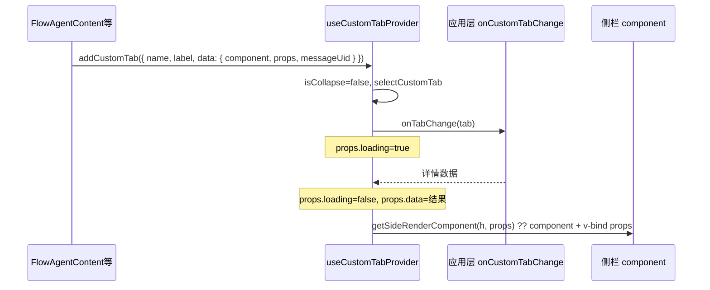

# 自定义侧栏内容

## 概述

用户选中侧栏某个 **自定义 Tab**（非默认「执行情况」）后，`ChatContainer` 在 Tab 栏下方渲染 **内容面板**。内容来源按优先级：

1. **`getSideRenderComponent(h, props)`** 返回的 VNode（应用层完全接管根组件）
2. 否则使用 **`addCustomTab` 时传入的 `data.component`**，并 `v-bind="data.props"`

异步数据通过 **`onCustomTabChange`** 在 Tab 切换时拉取，结果写入 `selectedTab.data.props`（含 `loading`、`data` 等字段）。

| 能力 | 入口 |
| ---- | ---- |
| 注册 Tab + 默认组件 | `addCustomTab` / `useCustomTabConsumer` |
| 切换时拉取详情 | `onCustomTabChange` |
| 覆盖内容根组件 | `getSideRenderComponent` |
| 主对话定位 | `data.messageUid` + 子组件 `#locateButton` 插槽 |

Tab **标签** UI 见 [自定义侧栏 Tab 标签](./custom-side-tab.md)。

## 数据流



## 类型

```typescript
import type { Component } from 'vue';
import type { CustomTab, CustomTabData } from '@blueking/chat-x';

// 库内 Flow 场景扩展（custom.ts）
type CustomBkFlowTabData = CustomTabData<{
  loading?: boolean;
  data?: Partial<NodeDetailData>;
  task_id?: number;
  task_name?: string;
  node_id?: string;
  node_name?: string;
  has_confidence?: boolean;
}>;

type CustomTab<T extends CustomTabData<Record<string, unknown>>> = {
  label: string;
  name: string;
  icon?: string;
  data?: T & {
    messageUid?: string; // 与活动消息 message.uid 一致，供「在对话中定位」
  };
};

type CustomTabData<T> = {
  component?: Component;
  props?: T;
};
```

业务可自定义 `props` 字段；`ChatContainer` 的 `onCustomTabChange` 泛型默认对齐 `CustomBkFlowTabData`。

## addCustomTab：注册内容与初始 props

深层组件通过 `useCustomTabConsumer` 注入 `addCustomTab`（须在 `ChatContainer` 子树内）。

`FlowAgentContent` 打开节点详情时的典型 payload：

```typescript
addCustomTab?.({
  label: node.name,
  name: `${task.task_id}|${node.id}|${node.name}`,
  data: {
    component: BkFlowNodeDetail, // 库内默认节点详情
    messageUid: props.messageUid,
    props: {
      loading: true,
      node_id: node.id,
      node_name: node.name,
      task_id: taskId,
      task_name: task.task_name,
      data: {},
    },
  },
});
```

| 字段 | 说明 |
| ---- | ---- |
| `data.component` | 未配置 `getSideRenderComponent` 或其对当前 props 返回 `undefined` 时使用的 Vue 组件 |
| `data.props` | 传给内容组件的 props；切换 Tab 时会被 `onCustomTabChange` 结果合并 |
| `data.messageUid` | 与 `ActivityMessage` 下发的 `message-uid` 一致，供侧栏「在对话中定位」 |

组件卸载时 `FlowAgentContent` 会按 task/node 调用 `removeCustomTab` 清理对应 Tab，避免残留。

## onCustomTabChange：切换时加载数据

```typescript
type OnCustomTabChange = (tab: CustomTab<CustomBkFlowTabData>) => Promise<unknown>;
```

`ChatContainer` 在 `useCustomTabProvider` 的 `onTabChange` 中：

1. 将当前 Tab 的 `data.props` 设为 `{ ...原 props, loading: true, data: {} }`（保留 task_id 等）
2. `await onCustomTabChange(tab)`
3. 合并为 `{ ...props, loading: false, data: 返回值 }`

应用层示例（Playground 模拟 3.5s 延迟后返回节点详情）：

```typescript
const handleCustomTabChange = async () => {
  await new Promise(resolve => setTimeout(resolve, 3500));
  return MOCK_NODE_DETAIL; // 写入 props.data
};
```

内容组件应：

- 根据 **`loading`** 展示骨架屏（如 `BkFlowNodeDetail`、`CustomTabContent`）
- 根据 **`data`** 渲染业务详情（节点基础信息、inputs/outputs 等）

## getSideRenderComponent：覆盖内容根组件

```typescript
type GetSideRenderComponent = (
  createElement: typeof h,
  props?: Record<string, unknown>,
) => VNode | undefined;
```

`props` 即当前选中 Tab 的 **`selectedTab.data.props`**（snake_case 字段与 Flow 协议一致，如 `task_id`、`node_name`）。

| 返回值 | 行为 |
| ------ | ---- |
| `VNode` | 使用该 VNode 作为侧栏内容根（**不再**使用 `data.component`） |
| `undefined` | 使用 `selectedTab.data.component`，并 `v-bind="selectedTab.data.props"` |

模板渲染（`chat-container.vue`）：

```vue
<component
  :is="getSideRenderComponent?.(h, selectedTab?.data?.props ?? {}) ?? selectedTab?.data?.component"
  :key="selectedTab.name"
  v-bind="selectedTab?.data?.props"
>
  <template #locateButton>
    <Button @click="handleLocateMessageGroup(selectedTab?.data?.messageUid)">
      {{ t('在对话中定位') }}
    </Button>
  </template>
</component>
```

### Playground：CustomTabContent

[`playground/custom-tab-content.vue`](../../playground/custom-tab-content.vue) 演示业务自定义侧栏：

- 头部保留 **`<slot name="locateButton" />`**，由容器注入定位按钮
- 根据 `loading` / `taskId` / `nodeName` 等 props 展示骨架或元数据

[`playground/chat-bot-new.vue`](../../playground/chat-bot-new.vue) 中 `getSideRenderComponent` 将 `tab.data.props` 映射为组件 camelCase props：

```typescript
const getSideRenderComponent = (createElement: typeof h, props?: Record<string, unknown>) => {
  const raw = props ?? {};
  return createElement(CustomTabContent, {
    loading: Boolean(raw.loading),
    nodeId: typeof raw.node_id === 'string' ? raw.node_id : '',
    nodeName: typeof raw.node_name === 'string' ? raw.node_name : '',
    taskId: /* 从 raw.task_id 解析 */,
    taskName: typeof raw.task_name === 'string' ? raw.task_name : '',
    data:
      typeof raw.data === 'object' && raw.data !== null && !Array.isArray(raw.data)
        ? (raw.data as Record<string, unknown>)
        : {},
  });
};
```

将 `PLAYGROUND_GET_SIDE_VNODE_DEMO` 设为 `false` 并 `return undefined` 可回退为库内 **`BkFlowNodeDetail`**。

## locateButton 与主对话定位

容器向内容组件提供具名插槽 **`locateButton`**。子组件在标题栏等区域声明：

```vue
<header>
  <h3>{{ title }}</h3>
  <slot name="locateButton" />
</header>
```

点击后 `ChatContainer` 执行 `handleLocateMessageGroup(messageUid)`：

1. 若存在 `document.getElementById(messageUid)`，滚动到该 DOM
2. 否则在 `messageGroups` 中查找 `message.uid === messageUid` 的消息组，滚动到组容器（`MessageGroup.uid`）

**务必**在 `addCustomTab` 的 `data` 上设置 `messageUid`（与活动消息 `message.uid` 一致）。`ActivityMessage` 向 `FlowAgentContent` 传递的 `message-uid` 即为此值。

库内参考：`flow-agent-node-detail.vue` 标题行内的 `<slot name="locateButton" />`。

## 完整接入示例

```vue
<template>
  <ChatContainer
    ref="chatContainerRef"
    :messages="messages"
    :get-side-render-component="getSideRenderComponent"
    :on-custom-tab-change="handleCustomTabChange"
    ...
  />
</template>

<script setup lang="ts">
  import { h, useTemplateRef } from 'vue';
  import { ChatContainer, type CustomTab } from '@blueking/chat-x';
  import MySidePanel from './MySidePanel.vue';

  const chatContainerRef = useTemplateRef('chatContainerRef');

  const handleCustomTabChange = async (tab: CustomTab) => {
    if (tab.name === 'execution') return;
    const detail = await fetchDetail(tab.name);
    return detail;
  };

  const getSideRenderComponent = (createElement: typeof h, props?: Record<string, unknown>) => {
    if (props?.has_confidence) {
      return createElement(MyConfidencePanel, props);
    }
    return undefined; // 使用 addCustomTab 注册的 component
  };

  // 也可由外层直接打开 Tab
  const openPanel = (messageUid: string) => {
    chatContainerRef.value?.addCustomTab({
      name: 'my-panel-1',
      label: '业务面板',
      data: {
        component: MySidePanel,
        messageUid,
        props: { loading: true, data: {} },
      },
    });
  };
</script>
```

`MySidePanel.vue` 需处理 `loading` / `data`，并预留 `locateButton` 插槽。

## 与「执行情况」Tab 的区别

| Tab | 内容 |
| --- | ---- |
| `EXECUTION_TAB_NAME`（`execution`） | 内置 `ExecutionSummary`，不走 `component` / `getSideRenderComponent` |
| 自定义 Tab | `getSideRenderComponent` ?? `data.component` + `onCustomTabChange` 数据 |

当 **`executionGroups` 为空且搜索关键词为空** 时，容器会 **`resetCustomTab`**，清空自定义 Tab 并折叠侧栏，避免无执行数据时仍显示节点详情 Tab。

## 设计建议

- **组件 + 拉数分离**：`data.component` 负责 UI 结构，`onCustomTabChange` 负责请求；避免在内容组件内重复监听 Tab 切换。
- **props 命名**：与后端/Flow 协议对齐时用 snake_case 写入 `data.props`，在 `getSideRenderComponent` 内再映射为组件 camelCase，与 Playground 一致。
- **loading 态**：切换 Tab 时容器会先置 `loading: true`，业务组件应统一骨架样式（可用全局 `.ai-skeleton-element`）。
- **key**：容器对内容使用 `:key="selectedTab.name"`，切换 Tab 会 remount，勿在子组件内假设长期挂载。

## 相关文档

- [自定义侧栏 Tab 标签](./custom-side-tab.md) — `getSideTabRenderComponent`
- [useCustomTab](../composables/use-custom-tab.md) — Provider / Consumer API
- [ChatContainer](../components/molecular/chat-container.md) — 侧栏、expose、`collapseChange`
- [自定义消息类型](./custom-message.md) — Activity / FlowAgent 与 `addCustomTab` 关系
