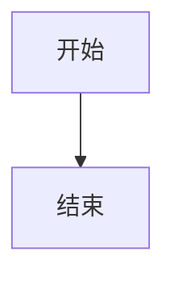
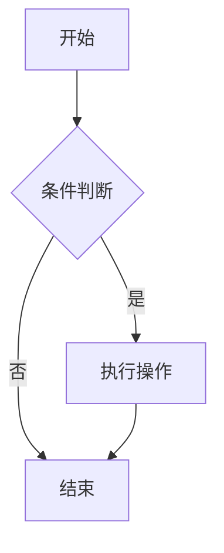
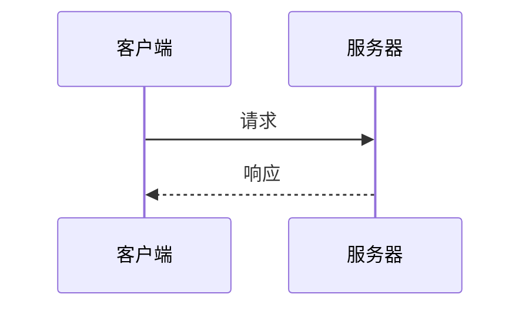
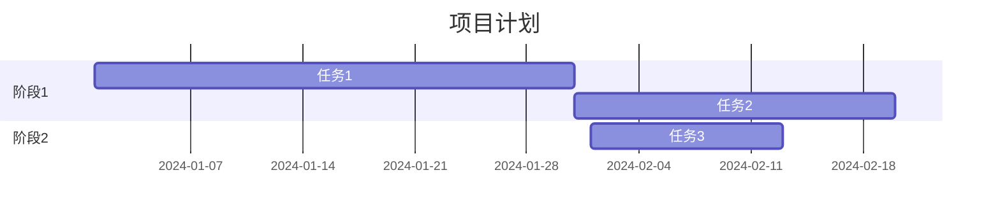
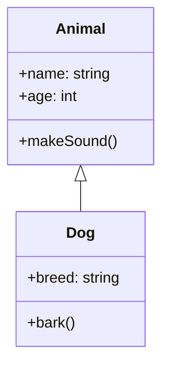
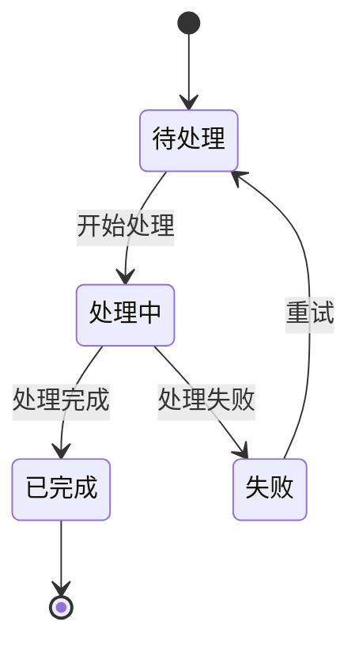
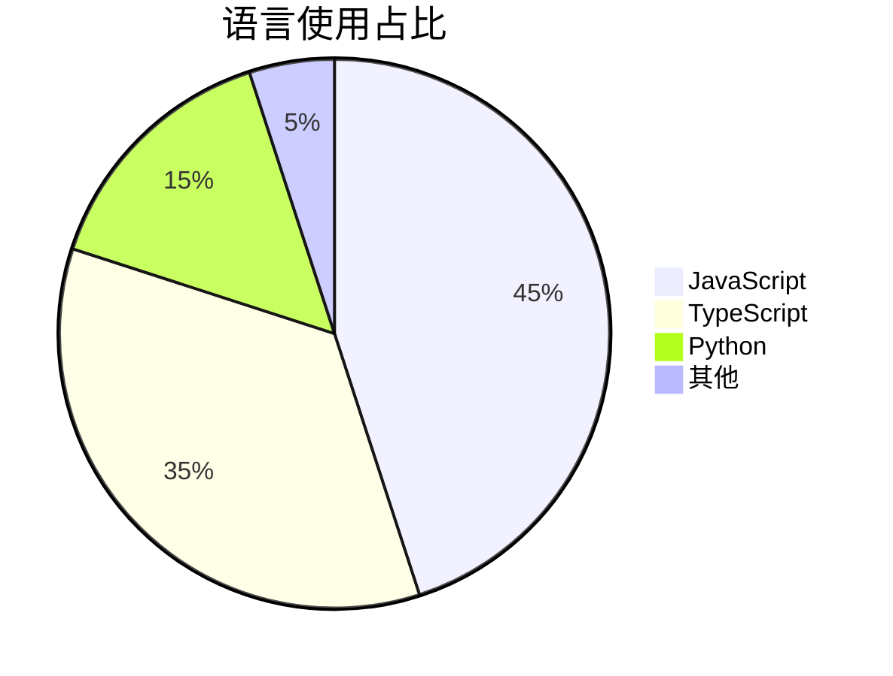
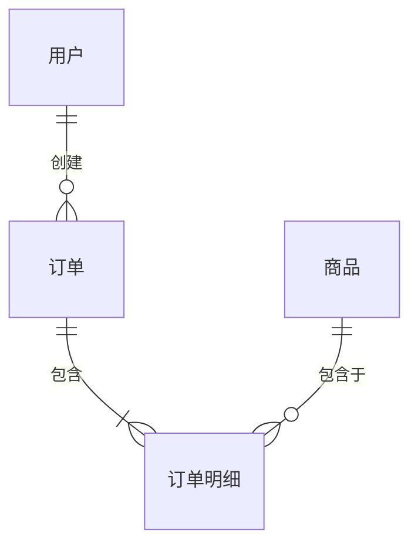

# markdownItMermaid Mermaid 解析插件

> **分类**：plugin

Markdown-it Mermaid 解析插件，用于解析 Mermaid 图表代码块。

## 功能说明

此插件将 Mermaid 代码块转换为特定的 HTML 结构，实际的 Mermaid 渲染在 `MermaidContent` 组件中完成。

## 支持的语法

````markdown

````

## 基础用法

```typescript
import MarkdownIt from 'markdown-it';
import { markdownItMermaid } from '@blueking/chat-x';

const md = new MarkdownIt().use(markdownItMermaid);

const html = md.render(`
\`\`\`mermaid
graph TD
    A[开始] --> B{判断}
    B -->|是| C[处理]
    B -->|否| D[结束]
    C --> D
\`\`\`
`);

// 输出:
// <div class="mermaid-wrapper" data-mermaid-code="..." data-mermaid-idx="0"></div>
```

## 渲染结果

插件会将 Mermaid 代码块转换为以下 HTML：

```html
<div
  class="mermaid-wrapper"
  data-mermaid-code="graph%20TD%0A%20%20%20%20A%5B%E5%BC%80%E5%A7%8B%5D%20--%3E%20B%5B%E7%BB%93%E6%9D%9F%5D"
  data-mermaid-idx="0"
></div>
```

- `data-mermaid-code`: URL 编码后的 Mermaid 代码
- `data-mermaid-idx`: 代码块索引

## 支持的图表类型

### 流程图 (Flowchart)

````markdown

````

### 时序图 (Sequence Diagram)

````markdown

````

### 甘特图 (Gantt Chart)

````markdown

````

### 类图 (Class Diagram)

````markdown

````

### 状态图 (State Diagram)

````markdown

````

### 饼图 (Pie Chart)

````markdown

````

### ER 图 (Entity Relationship)

````markdown

````

## 与 MermaidContent 组件配合

实际渲染由 `MermaidContent` 组件完成：

```vue
<template>
  <MermaidContent
    :token="mermaidTokens"
    @mounted="handleMounted"
  />
</template>

<script setup lang="ts">
  import { MermaidContent } from '@blueking/chat-x';

  // mermaidTokens 是包含 mermaid fence 的 token 数组
  const handleMounted = ({ el }) => {
    console.log('Mermaid 图表渲染完成:', el);
  };
</script>
```

## 流式渲染

组件支持流式渲染，在代码输入过程中实时更新图表：

````vue
<template>
  <ContentRender
    :content="streamingContent"
    :status="MessageStatus.Streaming"
  />
</template>

<script setup lang="ts">
  import { ref } from 'vue';
  import { ContentRender, MessageStatus } from '@blueking/chat-x';

  const streamingContent = ref('');

  // 模拟流式输入 Mermaid 代码
  const simulateStreaming = async () => {
    const code = '```mermaid\ngraph TD\n    A --> B\n```';
    for (const char of code) {
      await new Promise(r => setTimeout(r, 50));
      streamingContent.value += char;
    }
  };
</script>
````

## 错误处理

当 Mermaid 代码语法错误时：

1. 插件仍会正常解析并输出 HTML
2. `MermaidContent` 组件会捕获渲染错误
3. 控制台会输出警告信息
4. 图表区域保持空白，不会影响其他内容

## 性能优化

- **节流渲染**：流式输入时使用 100ms 节流
- **代码缓存**：相同代码不会重复渲染
- **异步加载**：Mermaid 库按需动态导入

## 使用场景

- AI 生成的流程图说明
- 技术文档中的架构图
- 项目计划展示
- 数据关系可视化

## 注意事项

1. **异步渲染**：Mermaid 库是动态导入的，首次渲染可能有短暂延迟
2. **语法验证**：组件会先验证语法，无效代码不会尝试渲染
3. **SVG 输出**：渲染结果是 SVG，可以自由缩放
4. **样式覆盖**：可以通过 CSS 自定义图表样式

## 关联组件

- [MermaidContent](../components/rendering/mermaid-content) — Mermaid 渲染
- [MarkdownContent](../components/rendering/markdown-content) — Markdown 内容
- [ContentRender](../components/rendering/content-render) — 内容渲染
