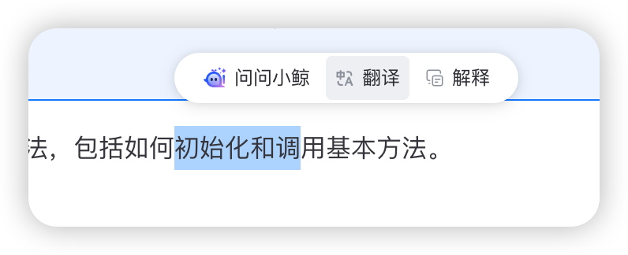

# 内容引用与快捷操作

AI 小鲸支持用户框选内容并通过快捷操作按钮进行交互，提供便捷的内容引用和快速操作能力。

## 内容引用

用户可以通过鼠标选取页面上的文本内容，选中后将自动弹出引用操作菜单，包含配置的快捷操作按钮。



## 配置快捷操作 (shortcuts)

> **重要提示**: v1.1.0版本对快捷操作进行了重大改动，现在表单数据将直接发送到后端处理，而不再使用前端拼接prompt的方式。**这要求后端必须进行适配**才能正常使用快捷操作功能。

开发者可以通过 `shortcuts` 属性配置自定义快捷操作，支持自定义表单输入的交互方式。

### 基础配置

```vue
<template>
  <AIBlueking 
    :url="apiUrl" 
    :shortcuts="customShortcuts"
  />
</template>

<script setup>
const customShortcuts = [
  {
    id: 'explain',
    name: '解释代码',
    icon: 'bkai-code',
    components: [
      {
        type: 'textarea',
        key: 'code',
        label: '代码内容',
        fillBack: true,
        placeholder: '请输入或选中需要解释的代码',
        rows: 4
      }
    ]
  },
  {
    id: 'translate',
    name: '翻译',
    icon: 'bkai-translate',
    components: [
      {
        type: 'textarea',
        key: 'text',
        label: '待翻译文本',
        fillBack: true,
        placeholder: '请输入或选中需要翻译的文本'
      },
      {
        type: 'select',
        key: 'targetLang',
        label: '目标语言',
        options: [
          { label: '中文', value: 'zh' },
          { label: '英文', value: 'en' },
          { label: '日文', value: 'jp' }
        ],
        placeholder: '请选择目标语言',
        default: 'en'  // 设置默认值
      }
    ]
  }
];
</script>
```

### 自定义表单组件

快捷操作现在支持自定义表单输入，可以配置多个表单组件用于收集用户输入。

目前支持的组件类型有：

- **text**: 单行文本输入框
- **textarea**: 多行文本输入框
- **select**: 下拉选择框
- **number**: 数字输入框

每个组件可以配置以下属性：

| 属性名 | 类型 | 描述 |
| ----- | ---- | ---- |
| `type` | `string` | 组件类型，如 'input'、'select'、'textarea'、'number' |
| `key` | `string` | 表单项数据的键名 |
| `name` | `string` | 表单项名称（推荐使用） |
| `label` | `string` | 表单项标签 |
| `placeholder` | `string` | 输入框占位文本 |
| `fillBack` | `boolean` | 是否自动填充用户选中的文本 |
| `fillRegx` | `string` 或 `RegExp` | 填充文本时使用的正则表达式 |
| `default` | `any` | 表单项的默认值 |
| `required` | `boolean` | 是否为必填项 |
| `rows` | `number` | 多行文本框的行数 (textarea) |
| `min` | `number` | 数字输入框的最小值 (number) |
| `max` | `number` | 数字输入框的最大值 (number) |
| `options` | `Array<{label: string, value: any}>` | 下拉选项（仅 select 类型有效） |

### 自动填充功能

通过 `fillBack` 和 `fillRegx` 属性，可以实现自动将用户选中的文本填充到表单项中。

- `fillBack: true` 表示该表单项会自动填充用户选中的文本
- `fillRegx` 可以用于通过正则表达式匹配选中文本的特定部分

```javascript
{
  id: 'summarize',
  name: '总结内容',
  icon: 'bkai-summary',
  components: [
    {
      type: 'textarea',
      key: 'text',
      label: '内容',
      fillBack: true,
      fillRegx: /(.{10,})/,  // 只匹配10个字符以上的内容，使用RegExp对象
      placeholder: '请输入或选中需要总结的内容'
    }
  ]
}
```

### 表单提交与事件处理

用户填写并提交表单后，会触发 `shortcut-click` 事件，事件参数中包含了用户填写的表单数据。

```vue
<template>
  <AIBlueking 
    :shortcuts="customShortcuts"
    @shortcut-click="handleShortcutClick"
  />
</template>

<script setup>
const handleShortcutClick = (data) => {
  console.log('快捷操作:', data.shortcut.name);
  console.log('表单数据:', data.formData);
  
  // 示例：翻译操作的表单数据
  // data.formData = [
  //   { key: 'text', value: '选中的文本内容' },
  //   { key: 'targetLang', value: 'en' }
  // ]
};
</script>
```

### 后端数据格式

表单数据会随请求一起发送到服务端，后端接收到的数据结构如下：

```javascript
// 后端接收到的数据结构示例
{
  // ... 其他参数
  "property": {
    "extra": {
      "command": "translate",  // 快捷操作ID
      "context": [
        { "key": "text", "value": "这是需要翻译的文本" },
        { "key": "targetLang", "value": "en" }
        // ... 其他表单数据
      ]
    }
  }
}
```

> **重要**: 后端需要根据`command`识别操作类型，并从`context`中获取表单数据进行处理，不再依赖前端拼接的prompt字符串。

## 启用选中文本弹出菜单

通过设置 `enablePopup` prop 为 `true` (默认值)，用户在页面上选中一段文本后，会自动在选中文本附近弹出一个小图标。点击该图标会展开快捷操作菜单（如果配置了 `shortcuts`）并自动将选中的文本作为引用内容。

```vue
<template>
  <AIBlueking :url="apiUrl" :enable-popup="true" />
</template>

<script setup> // 或 <script>
import AIBlueking from '@blueking/ai-blueking'; // 或 /vue2
import '@blueking/ai-blueking/dist/vue3/style.css'; // 或 /vue2
const apiUrl = '...';
</script>
```

如果设置为 `false`，则不会在选中文本后弹出菜单。

## 快捷操作事件 (shortcut-click)

当用户点击快捷操作按钮时，会触发 `shortcut-click` 事件。您可以监听此事件以执行自定义逻辑。

:::code-group
```vue [Vue 3]
<template>
  <AIBlueking :url="apiUrl" :shortcuts="myShortcuts" @shortcut-click="handleShortcut" />
</template>

<script lang="ts" setup>
import AIBlueking from '@blueking/ai-blueking';
import '@blueking/ai-blueking/dist/vue3/style.css';

const apiUrl = '...';
const myShortcuts = [ /* ... */ ];

const handleShortcut = (data) => {
  console.log('快捷操作:', data.shortcut.name);
  console.log('表单数据:', data.formData);
  // 可以在这里做一些额外处理，比如打点上报
};
</script>
```

```vue [Vue 2]
<template>
  <AIBlueking :url="apiUrl" :shortcuts="myShortcuts" @shortcut-click="handleShortcut" />
</template>

<script>
import AIBlueking from '@blueking/ai-blueking/vue2';
import '@blueking/ai-blueking/dist/vue2/style.css';

export default {
  components: { AIBlueking },
  data() {
    return { apiUrl: '...', myShortcuts: [ /* ... */ ] };
  },
  methods: {
    handleShortcut(data) {
      console.log('快捷操作:', data.shortcut.name);
      console.log('表单数据:', data.formData);
      // 可以在这里做一些额外处理，比如打点上报
    }
  }
};
</script>
```
:::

## 编程式触发快捷操作

以下示例展示了如何在代码中触发快捷操作，例如通过点击页面上的按钮：

:::code-group
```vue [Vue 3]
<template>
  <div>
    <!-- 文章内容 -->
    <div class="article">
      <h3>{{ articleTitle }}</h3>
      <p>{{ articleContent }}</p>
    </div>

    <!-- 快捷操作按钮 -->
    <div class="action-buttons">
      <button @click="triggerShortcut('explain', articleTitle)">解释标题</button>
      <button @click="triggerShortcut('translate', articleTitle)">翻译标题</button>
    </div>

    <!-- AI小鲸组件 -->
    <AIBlueking 
      ref="aiBlueking" 
      :url="apiUrl" 
      :shortcuts="shortcuts"
    />
  </div>
</template>

<script lang="ts" setup>
import { ref } from 'vue';
import AIBlueking from '@blueking/ai-blueking';
import { IShortcut } from '@blueking/ai-blueking/dist/types';

const aiBlueking = ref<InstanceType<typeof AIBlueking>>();
const articleTitle = 'AI 技术的发展与应用';
const articleContent = '人工智能技术在近年来取得了突飞猛进的发展...';

const shortcuts: IShortcut[] = [
  {
    id: 'explain',
    name: '解释',
    components: [
      { type: 'textarea', key: 'text', label: '内容', fillBack: true }
    ]
  },
  {
    id: 'translate',
    name: '翻译',
    components: [
      { type: 'textarea', key: 'text', label: '内容', fillBack: true },
      { 
        type: 'select', 
        key: 'targetLang', 
        label: '目标语言',
        options: [
          { label: '英文', value: 'en' },
          { label: '日文', value: 'jp' }
        ],
        default: 'en'
      }
    ]
  }
];

// 编程式触发快捷操作
const triggerShortcut = (id: string, text: string) => {
  if (!aiBlueking.value) return;
  
  // 找到对应ID的快捷操作
  const shortcut = shortcuts.find(s => s.id === id);
  if (!shortcut) return;
  
  // 显示AI小鲸窗口
  aiBlueking.value.handleShow();
  
  // 找到需要填充的表单项
  const textComponent = shortcut.components.find(c => c.fillBack);
  if (textComponent) {
    textComponent.selectedText = text;
  }
  
  // 触发快捷操作
  aiBlueking.value.handleShortcutClick(shortcut);
};
</script>
```

```vue [Vue 2]
<template>
  <div>
    <!-- 文章内容 -->
    <div class="article">
      <h3>{{ articleTitle }}</h3>
      <p>{{ articleContent }}</p>
    </div>

    <!-- 快捷操作按钮 -->
    <div class="action-buttons">
      <button @click="triggerShortcut('explain', articleTitle)">解释标题</button>
      <button @click="triggerShortcut('translate', articleTitle)">翻译标题</button>
    </div>

    <!-- AI小鲸组件 -->
    <AIBlueking 
      ref="aiBlueking" 
      :url="apiUrl" 
      :shortcuts="shortcuts"
    />
  </div>
</template>

<script>
import AIBlueking from '@blueking/ai-blueking/vue2';

export default {
  components: { AIBlueking },
  
  data() {
    return {
      apiUrl: '...',
      articleTitle: 'AI 技术的发展与应用',
      articleContent: '人工智能技术在近年来取得了突飞猛进的发展...',
      shortcuts: [
        {
          id: 'explain',
          name: '解释',
          components: [
            { type: 'textarea', key: 'text', label: '内容', fillBack: true }
          ]
        },
        {
          id: 'translate',
          name: '翻译',
          components: [
            { type: 'textarea', key: 'text', label: '内容', fillBack: true },
            { 
              type: 'select', 
              key: 'targetLang', 
              label: '目标语言',
              options: [
                { label: '英文', value: 'en' },
                { label: '日文', value: 'jp' }
              ],
              default: 'en'
            }
          ]
        }
      ]
    };
  },
  
  methods: {
    triggerShortcut(id, text) {
      // 找到对应ID的快捷操作
      const shortcut = this.shortcuts.find(s => s.id === id);
      if (!shortcut) return;
      
      // 显示AI小鲸窗口
      this.$refs.aiBlueking.handleShow();
      
      // 找到需要填充的表单项
      const textComponent = shortcut.components.find(c => c.fillBack);
      if (textComponent) {
        textComponent.selectedText = text;
      }
      
      // 触发快捷操作
      this.$refs.aiBlueking.handleShortcutClick(shortcut);
    }
  }
}
</script>
```
:::

> **注意**: 在v1.1.0版本中，不再推荐使用sendChat方法来模拟快捷操作，应该直接使用组件暴露的handleShortcutClick方法并传入完整的IShortcut对象。