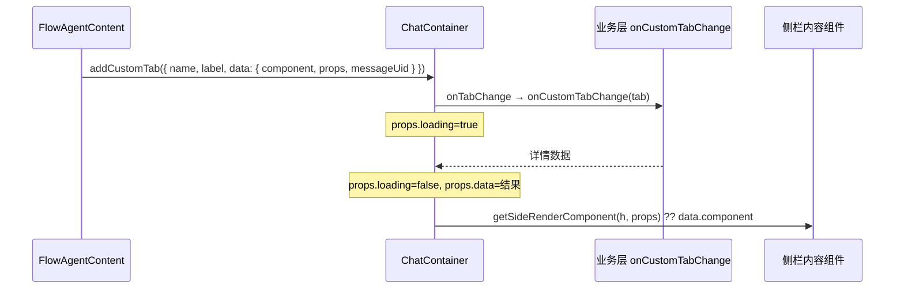

# 侧栏 Tab 自定义渲染

> **自 v2.1.4-beta.7 起**，`ChatBot` / `AIBlueking` 支持将 FlowAgent 等场景下侧栏自定义 Tab 的**内容区**与**标签栏**交由业务方渲染，并与主对话区「在对话中定位」联动。

## 概述

带执行情况侧栏的对话布局中，除默认「执行情况」Tab 外，FlowAgent 等活动消息可通过 `addCustomTab` 打开节点详情等自定义 Tab。此前需在 `ChatContainer` 层配置 `getSideRenderComponent` 等能力；自 **v2.1.4-beta.7** 起，以下 Props 已透传到 **`ChatBot`** 与 **`AIBlueking`**，集成方无需再单独包裹 `ChatContainer`。

| 能力 | Prop | 说明 |
| --- | --- | --- |
| 自定义侧栏**内容** | `getSideRenderComponent` | 按当前 Tab 的 `data.props` 返回 VNode，覆盖 `addCustomTab` 注册的 `data.component` |
| 自定义 Tab **标签** | `getSideTabRenderComponent` | 自定义标签栏图标、文案、关闭按钮等 |
| 切换 Tab 时**拉取详情** | `onCustomTabChange` | 异步返回详情数据，写入 `data.props`（含 `loading`、`data`）；不传时 `ChatBot` 对 Flow 节点 Tab 走内置 `getFlowAgentTaskNodeInfo` |

与 [消息自定义渲染](/guide/core-features/custom-message-rendering) 的区别：

- **消息自定义渲染**：主对话区消息体内的 `custom-component` 块
- **侧栏自定义渲染**：右侧（或 `placement` 指定侧）执行情况面板中的 Tab 内容与标签

底层机制与 `@blueking/chat-x` 的 `ChatContainer` 一致，详见 chat-x Wiki「自定义侧栏内容 / Tab 标签」。

## 数据流



选中自定义 Tab 后，内容区渲染优先级为：

1. `getSideRenderComponent(h, selectedTab.data.props)` 返回的 VNode
2. 否则使用 `addCustomTab` 时传入的 `data.component`，并 `v-bind="data.props"`

## 快速开始

### 1. 定义侧栏内容组件

内容组件需根据 `loading` / `data` 展示骨架与详情，并在标题区保留 **`locateButton` 插槽**（由容器注入「在对话中定位」按钮）：

```vue
<!-- CustomTabContent.vue -->
<template>
  <div>
    <header>
      <h3>{{ loading ? '加载中…' : titleText }}</h3>
      <slot name="locateButton" />
    </header>
    <div v-if="loading" class="skeleton" />
    <dl v-else>
      <dt>node_name</dt>
      <dd>{{ nodeName }}</dd>
      <!-- 使用 props.data 渲染业务字段 -->
    </dl>
  </div>
</template>

<script setup lang="ts">
defineProps<{
  loading?: boolean;
  nodeId?: string;
  nodeName?: string;
  taskId?: number;
  taskName?: string;
  data?: Record<string, unknown>;
}>();
</script>
```

### 2. 封装渲染函数（推荐 composable）

```typescript
// use-side-render-handlers.ts
import { h } from 'vue';
import CustomTabContent from './CustomTabContent.vue';
import type { GetSideRenderComponent, GetSideTabRenderComponent } from '@blueking/ai-blueking';

export function useSideRenderHandlers() {
  const getSideRenderComponent: GetSideRenderComponent = (createElement, props) => {
    const raw = props ?? {};
    return createElement(CustomTabContent, {
      loading: Boolean(raw.loading),
      nodeId: typeof raw.node_id === 'string' ? raw.node_id : '',
      nodeName: typeof raw.node_name === 'string' ? raw.node_name : '',
      taskId: typeof raw.task_id === 'number' ? raw.task_id : undefined,
      taskName: typeof raw.task_name === 'string' ? raw.task_name : '',
      data:
        typeof raw.data === 'object' && raw.data !== null && !Array.isArray(raw.data)
          ? (raw.data as Record<string, unknown>)
          : {},
    });
  };

  const getSideTabRenderComponent: GetSideTabRenderComponent = (createElement, tab, { removeCustomTab }) => {
    // 仅自定义 Flow 节点 Tab（name 形如 task_id|node_id|node_name）
    if (!tab.name.includes('|')) return undefined;

    const [, , nodeName = ''] = tab.name.split('|');
    return createElement('span', { style: { display: 'inline-flex', alignItems: 'center', gap: '6px' } }, [
      createElement('span', {}, nodeName || tab.label),
      createElement('button', {
        type: 'button',
        onClick: (e: Event) => {
          e.stopPropagation();
          removeCustomTab(tab.name);
        },
      }, '×'),
    ]);
  };

  return { getSideRenderComponent, getSideTabRenderComponent };
}
```

Flow 协议侧 `data.props` 常用 **snake_case**（如 `task_id`、`node_name`），在 `getSideRenderComponent` 内映射为组件 **camelCase** props 即可。

### 3. 挂到 ChatBot / AIBlueking

```vue
<template>
  <ChatBot
    url="/api/ai"
    :get-side-render-component="getSideRenderComponent"
    :get-side-tab-render-component="getSideTabRenderComponent"
    @execution-panel-change="onExecutionPanelChange"
  />
</template>

<script setup lang="ts">
import { ChatBot } from '@blueking/ai-blueking';
import '@blueking/ai-blueking/style.css';
import { useSideRenderHandlers } from './use-side-render-handlers';

const { getSideRenderComponent, getSideTabRenderComponent } = useSideRenderHandlers();

function onExecutionPanelChange(isCollapse: boolean) {
  // 侧栏展开/收起时，若外层有 draggable 容器，需同步布局（见注意事项）
}
</script>
```

`AIBlueking` 用法相同，将上述三个 Prop 传给内层 `ChatBot` 即可。

## onCustomTabChange（可选）

类型：

```typescript
import type { OnCustomTabChange } from '@blueking/ai-blueking';

const onCustomTabChange: OnCustomTabChange = async (tab) => {
  const { task_id, node_id } = tab.data?.props ?? {};
  if (task_id == null || !node_id) return {};
  const detail = await fetchMyNodeDetail(task_id, node_id);
  return detail; // 合并进 tab.data.props.data，并置 loading=false
};
```

| 场景 | 行为 |
| --- | --- |
| **未传** `onCustomTabChange` | `ChatBot` 对含 `task_id`、`node_id` 的 Flow 节点 Tab 自动调用 `chatHelper.message.getFlowAgentTaskNodeInfo` |
| **已传** | 完全由业务方返回详情，内置拉取不再执行 |

切换 Tab 时容器会先将 `props.loading` 设为 `true`，再 `await onCustomTabChange(tab)`，最后合并 `{ loading: false, data: 返回值 }`。

## 类型导出

从 `@blueking/ai-blueking` 引入：

```typescript
import type {
  GetSideRenderComponent,
  GetSideTabRenderComponent,
  OnCustomTabChange,
} from '@blueking/ai-blueking';
```

## 与 FlowAgent / addCustomTab 的关系

- **打开 Tab**：仍由 `FlowAgentContent` 等内部调用 `useCustomTabConsumer().addCustomTab()`，业务方通常无需手动调用
- **覆盖展示**：通过 `getSideRenderComponent` / `getSideTabRenderComponent` 统一替换默认的 `BkFlowNodeDetail` 与默认标签样式
- **定位联动**：`addCustomTab` 的 `data.messageUid` 须与活动消息 `message.uid` 一致；内容组件保留 `#locateButton` 插槽

直接使用 `ChatContainer` 时，Prop 名称与行为相同，见 [ChatBot API](/api/ai-blueking/chatbot#side-render-customization)。

::: info 版本要求
本能力自 **v2.1.4-beta.7** 起在 `ChatBot` / `AIBlueking` 上提供；更低版本请直接使用 `@blueking/chat-x` 的 `ChatContainer` 同名 Props。
:::

## 注意事项

::: warning 外层 draggable 与侧栏展开
若 `ChatBot` 包在可拖拽面板内，监听 `execution-panel-change`，在侧栏因 `addCustomTab` 自动展开时同步外层布局（与 `isCollapse` 联动）。
:::

::: info 执行情况 Tab 清空自定义 Tab
当 `executionGroups` 为空且搜索关键词为空时，`ChatContainer` 会 `resetCustomTab`，清空自定义 Tab 并折叠侧栏。
:::

::: info props 命名与 remount
侧栏内容使用 `:key="selectedTab.name"`，切换 Tab 会重建子树。`data.props` 建议与后端 Flow 字段对齐（snake_case），在 `getSideRenderComponent` 中再映射为组件 props。
:::

## 参考示例

仓库内 Playground（`packages/ai-blueking/playground`）提供完整示例：

- 页面：`views/SideRenderView.vue`（路由 `/examples/side-render`）
- 组件：`components/side-render/CustomTabContent.vue`、`FlowAgentSideRenderDemo.vue`
- 逻辑：`components/side-render/use-side-render-handlers.ts`

本地调试：在 ai-blueking 包目录执行 `pnpm dev:ai`，访问侧栏渲染示例页。

## 相关文档

- [消息自定义渲染](/guide/core-features/custom-message-rendering) — 主对话区 `custom-component` 块
- [ChatBot API — 侧栏自定义渲染](/api/ai-blueking/chatbot#side-render-customization)
- [AIBlueking API](/api/ai-blueking/aiblueking)
- [类型定义 — GetSideRenderComponent 等](/api/ai-blueking/types#getsiderendercomponent)
